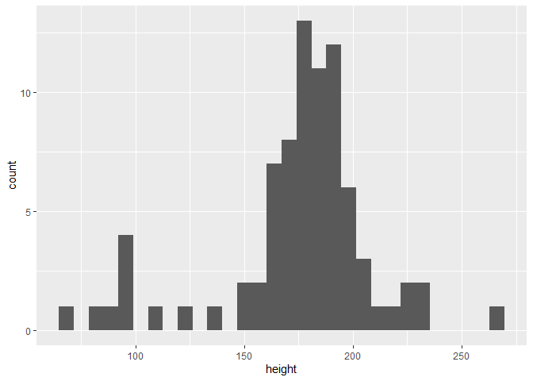
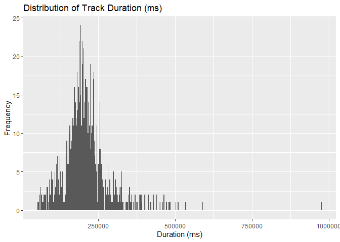
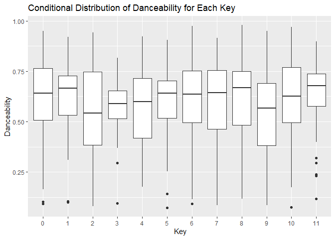
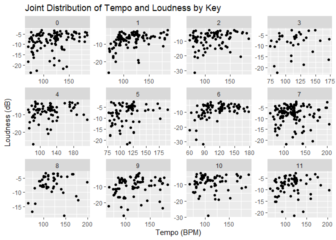

STATS 406, Homework 01
================
Vy Dang, ivydang

## Setup

If you have not installed the `tidyverse` collection of packages, you
should receive a prompt at the top of your editor window to do so. We
will also need the `bench` package.

You can verify that they are installed by clicking on the “Knit” button
in the tool bar of the editing window.

## Problem 1 (2 pts)

### Part (a) (1 pt)

The following block of text is adapted from the [Wikipedia page on
R](https://en.wikipedia.org/wiki/R_(programming_language)). If you look
at the source code for this document (the .Rmd file), you will see that
the text is in HTML format. Your job is to recreate the RMarkdown I used
to create this formatting.

- [Markdown basics](https://www.markdownguide.org/basic-syntax/)
- The `Help > Cheatsheets > R Markdown Cheat Sheet` menu option
- You may find it easiest to copy the text from the rendered HTML into
  this .Rmd file, and then perform the necessary formatting.
- For the block of R code, **you do not need to actually execute this
  code**. (Use `eval = FALSE` in the chunk header)
- The Mandelbrot image can be found at
  `https://upload.wikimedia.org/wikipedia/commons/thumb/a/a7/Mandelbrot_Creation_Animation.gif/400px-Mandelbrot_Creation_Animation.gif`

------------------------------------------------------------------------

<h3>
Mandelbrot set
</h3>
<p>
Short R code calculating
<a href="https://en.wikipedia.org/wiki/Mandelbrot_set">Mandelbrot
set</a> through the first 20 iterations of equation
<span class="math inline">$z = z^2 + c$</span> plotted for different
complex constants <span class="math inline">$c$</span>. This example
demonstrates:
</p>
<ul>
<li>
use of <strong>community-developed</strong> external libraries (called
packages), in this case caTools package
</li>
<li>
handling of
<a href="https://en.wikipedia.org/wiki/Complex_numbers">complex
numbers</a>
</li>
<li>
multidimensional arrays of numbers used as basic data type, see
variables <code>C</code>, <code>Z</code> and <code>X</code>.
</li>
</ul>
<pre class="r"><code>install.packages(&quot;caTools&quot;)  # install external package
library(caTools)             # external package providing write.gif function
jet.colors &lt;- colorRampPalette(c(&quot;red&quot;, &quot;blue&quot;, &quot;#007FFF&quot;, &quot;cyan&quot;, &quot;#7FFF7F&quot;,
                                 &quot;yellow&quot;, &quot;#FF7F00&quot;, &quot;red&quot;, &quot;#7F0000&quot;))
dx &lt;- 1500                    # define width
dy &lt;- 1400                    # define height
C  &lt;- complex(real = rep(seq(-2.2, 1.0, length.out = dx), each = dy),
              imag = rep(seq(-1.2, 1.2, length.out = dy), dx))
C &lt;- matrix(C, dy, dx)       # reshape as square matrix of complex numbers
Z &lt;- 0                       # initialize Z to zero
X &lt;- array(0, c(dy, dx, 20)) # initialize output 3D array
for (k in 1:20) {            # loop with 20 iterations
  Z &lt;- Z^2 + C               # the central difference equation
  X[, , k] &lt;- exp(-abs(Z))   # capture results
}
write.gif(X, &quot;Mandelbrot.gif&quot;, col = jet.colors, delay = 100)</code></pre>

## <!-- <p></p> -->

### Part (b) (1 pt)

In this section we will use RMarkdown’s math notation system. If you
have encountered LaTeX’s math notation, you will find it very familiar
(though I am not expecting students to be know this system).

[Cosma Shazili’s
reference](http://www.stat.cmu.edu/~cshalizi/rmarkdown/#math-in-r-markdown)
is a very helpful reference for notation commonly used in statistics.

In following, replace the `\ldots` in the prompts with appropriate math
notation.

By default, all characters are treated as single letter variable names:

$$
2x + yz
$$

Write the expression for a line “y = m x + b”:

$$
y=mx+b
$$

All commands (sometimes called “macros”) for this language use `\`
followed by the name of the command, and zero or more arguments enclosed
in curly braces `{...}`. Some examples:

- $\pi$
- $\sqrt{x}$
- $\frac{x}{y}$

We can add subscripts (`_`) and superscripts (`^`) to variables:
$X_i^2$.

Write the function “f” that computes Euclidean distance:


$$
f(x,y)= \sqrt{x^2+y^2}
$$

Many convenient notations for things like sums and integrals have
ranges. These are achieved by using a subscript and a superscript on the
command:

$$
e^x = \sum_{i=0}^\infty \frac{x^i}{i!} 
$$

Notice that to achieve the $i = 0$ in the subscript we had to wrap it in
curly braces: `{i = 0}`.

The `\int` command is similar to sum. Use it to notate the area under
the curve of the function $\sin(x)/\cos(x)$ from 0 to $\pi/4$.


$$
\int_{0}^{\frac{\pi}{4}} \frac{\sin(x)}{\cos(x)} dx
$$

When writing multiple line statements, it can be useful to use the
`aligned` environment: $$
\begin{aligned}
  f(x) &= x^2 + 6x + 9 \\
  &= (x + 3) (x + 3) \\
  & = (x + 3)^2
\end{aligned}
$$

Notice that the `&` character is used to align the lines and the `\\`
command creates a new line.

We often have need of “hats” and “bars”, $\bar X$ and $\hat \theta$.

For expressions that are tall we can add balanced parentheses and
brackets to get a nicer result. For example, compare

$$
(\frac{e^x}{y})
$$ to $$
\left( \frac{e^x}{y} \right)
$$

Write a multiline proof that the expectation of the sample mean of
identically distributed data is equal to the population expectation:

 \` $$
\begin{aligned} \mathbb{E}[\bar{X}] &= \mathbb{E}\left( \frac{1}{n} \sum_{i=1}^n X_i \right) \\ &= \frac{1}{n} \mathbb{E} \left(\sum_{i=1}^n X_i \right) \\ &= \frac{1}{n} \sum_{i=1}^n \mathbb{E}(Xi) \\ &= \frac{1}{n} \cdot n \mathbb{E}(X) \\ &= \mathbb{E}(X) \end{aligned} 
$$

The `\text{...}` command can be useful when you want to have standard
format text in an expression. Use that to write an identity about the
variance of a scaled random variable:


$$
\text{Var}(aX)=a^2 \text{Var}(X)
$$

## Problem 2 (3 points)

The `starwars$height` column lists the heights (in centimeters) of
characters in the Star Wars franchise of movies.

``` r
ggplot(starwars, aes(x = height)) + geom_histogram()
```

    ## `stat_bin()` using `bins = 30`. Pick better value with `binwidth`.

    ## Warning: Removed 6 rows containing non-finite values (`stat_bin()`).



We will convert those measurements in centimeters to heights in inches.

$$D_I = \frac{D_C}{2.54}$$

The average height in inches is given by:

``` r
mean(starwars$height, na.rm = TRUE) / 2.54
```

    ## [1] 68.7421

The next part, “verify” means to print out results that demonstrate a
property.

### Part (a) (0.5 pts)

Use vectorized computations to create a new vector of heights in inches.

Verify that the average height using the `mean` function.

``` r
height_inches <- starwars$height/2.54
mean(height_inches, na.rm = TRUE)
```

    ## [1] 68.7421

### Part (b) (0.5 pts)

Use a `for` loop to create a new vector of heights in inches.

Verify that the average height using the `mean` function.

``` r
height_inches_loop <- numeric(length(starwars$height))
for (i in 1:length(starwars$height)) {
  height_inches_loop[i] <- starwars$height[i]/2.54
}
mean(height_inches_loop,na.rm = TRUE)
```

    ## [1] 68.7421

### Part (c) (0.5 pts)

Use a `map` function to create a new vector of heights in inches. (Hint:
the next step will be easier if you use something more specialized than
`map` itself.)

Verify that the average height using the `mean` function.

``` r
library(purrr)
height_inches_map <- map_dbl(starwars$height, function(height) height/2.54)
mean(height_inches_map, na.rm = TRUE)
```

    ## [1] 68.7421

### Part (d) (1 pt)

For each of your techniques above, create functions that take vectors of
measurements in centimeters and return the measurements in inches. Call
your functions:

- `to_inches_vec`
- `to_inches_for`
- `to_inches_map`

Using the `mutate` and `summarize` functions, transform the `heights`
column from `starwars` into inches and compute the mean height for each
transformed column.

``` r
library(dplyr)
to_inches_vec <- function(heights_cm) {
  return (heights_cm/2.54)
}
to_inches_for <- function(heights_cm) {
  heights_in <- numeric(length(heights_cm))
  for (i in 1:length(heights_cm)) {
    heights_in[i] = heights_cm[i]/2.54
  }
  return(heights_in)
}
to_inches_map <- function(heights_cm) {
  map_dbl(starwars$height, function(height) height/2.54)
}
```

``` r
starwars |> mutate(height_inches_vec = to_inches_vec(height)) |>
  summarize(mean_height_vec = mean(height_inches_vec, na.rm = TRUE))
```

    ## # A tibble: 1 × 1
    ##   mean_height_vec
    ##             <dbl>
    ## 1            68.7

``` r
starwars |> mutate(height_inches_for = to_inches_for(height)) |>
  summarize(mean_height_for = mean(height_inches_for, na.rm = TRUE))
```

    ## # A tibble: 1 × 1
    ##   mean_height_for
    ##             <dbl>
    ## 1            68.7

``` r
starwars |> mutate(height_inches_map = to_inches_map(height)) |>
  summarize(mean_height_map = mean(height_inches_map, na.rm = TRUE))
```

    ## # A tibble: 1 × 1
    ##   mean_height_map
    ##             <dbl>
    ## 1            68.7

### Part (e) (0.5 points)

The `bench::mark` function provides “microbenchmarking” of functions in
R. It runs the input functions repeatedly and shows which run faster.
Here is a demonstration.

``` r
myvariance <- function(x) {
  squares <- map_dbl(x, ~ (.x - mean(x))^2)
  sum(squares) / (length(x) - 1)
}

v <- rnorm(1000)
bench::mark(myvariance(v), var(v))
```

    ## # A tibble: 2 × 6
    ##   expression         min   median `itr/sec` mem_alloc `gc/sec`
    ##   <bch:expr>    <bch:tm> <bch:tm>     <dbl> <bch:byt>    <dbl>
    ## 1 myvariance(v)   5.71ms   6.13ms      159.    7.86KB     8.72
    ## 2 var(v)           7.4µs    8.1µs   115596.    13.7KB    11.6

We can see that my version of the sample variance runs many fewer
iterations per second, which means it is slower.

Using `bench::mark` compare your three functions from the previous part
using the `starwars$heights` as input.

``` r
bench::mark(
  to_inches_vec(starwars$height),
  to_inches_for(starwars$height),
  to_inches_map(starwars$height)
)
```

    ## # A tibble: 3 × 6
    ##   expression                          min   median `itr/sec` mem_alloc `gc/sec`
    ##   <bch:expr>                     <bch:tm> <bch:tm>     <dbl> <bch:byt>    <dbl>
    ## 1 to_inches_vec(starwars$height)    1.2µs    1.5µs   542658.     8.5KB      0  
    ## 2 to_inches_for(starwars$height)    5.2µs    5.9µs   153614.      744B     15.4
    ## 3 to_inches_map(starwars$height)   51.9µs   61.1µs    15430.    15.6KB     14.5

## Problem 3 (3 pts)

Spotify publishes an [API for playlists, tracks, and user
data](https://developer.spotify.com/documentation/web-api/). I’ve
already retrieved some data from Spotify, included in the the
`tracks.rda` file included with this homework. One neat aspect of
Spotify’s data is the [audio
features](https://developer.spotify.com/documentation/web-api/reference/tracks/get-several-audio-features/).
These features rate tracks on many qualities such as “danceability” or
whether the track seems to be “acoustic.” We will investigate the
relationships between these qualities for nearly 1000 tracks.

To use the data, place `tracks.rda` in the same directory as this file.
Before knitting this file, use the
`Session -> Set Working Directory -> To Source File Location` menu so
that following line will load the data and display a few of the columns
in the table.

``` r
load("tracks.rda")
knitr::kable(tracks[c(1,2,335), c("track.album.name", "track.name", 
                                  "danceability", "energy", "key", "loudness", "mode")])
```

|  | track.album.name | track.name | danceability | energy | key | loudness | mode |
|:---|:---|:---|---:|---:|---:|---:|---:|
| 1 | The Avengers | The Avengers | 0.436 | 0.560 | 7 | -8.238 | 1 |
| 2 | The New Loud | Butterflies | 0.592 | 0.327 | 4 | -12.076 | 0 |
| 354 | Revenge Of The Dreamers III | Costa Rica (with Bas & JID feat. Guapdad 4000, Reese LAFLARE, Jace, Mez, Smokepurpp, Buddy & Ski Mask The Slump God) | 0.642 | 0.647 | 7 | -6.312 | 0 |

``` r
dim(tracks)
```

    ## [1] 967  57

### Part a (1 pt)

We’ll start by just getting a feeling for the data by answering the
following questions.

- What is the mean danceability score of all tracks?

``` r
mean(tracks$danceability, na.rm = TRUE)
```

    ## [1] 0.5976295

- For tracks with danceability above the mean, what is the median
  duration?

``` r
mean(tracks$danceability, na.rm = TRUE) -> mean_danceability
tracks |> filter(danceability > mean_danceability) |> 
  summarize(new_median_dur = median(duration_ms, na.rm = TRUE))
```

    ##   new_median_dur
    ## 1         194898

- For each key, summarize mean loudness level? (Hint: use the `group_by`
  and `summarize` functions.)

``` r
tracks |> group_by(key) |> summarize(mean_loudness = mean(loudness, na.rm = TRUE))
```

    ## # A tibble: 12 × 2
    ##      key mean_loudness
    ##    <int>         <dbl>
    ##  1     0         -8.27
    ##  2     1         -7.61
    ##  3     2         -8.87
    ##  4     3         -8.73
    ##  5     4         -8.18
    ##  6     5         -8.24
    ##  7     6         -8.65
    ##  8     7         -7.98
    ##  9     8         -7.28
    ## 10     9        -10.0 
    ## 11    10         -8.76
    ## 12    11         -8.34

### Part b (2 pts)

Since tracks can have multiple artists, the “track.artists” column is
composed of lists with information on each artist that contributes to
the track. To make display a little easier, your first task is to create
a new column for the `tracks` that just display’s all the artists as a
single bit of text. To demonstrate your results, create the previous
table with the addition of the artist names.

Some useful functions:

- `mutate` will return a new table with one or more new columns added
- `map_chr` will iterate across a list or vector and return text
  (“character vector” in R terminology). ([More information on `map`
  functions](https://r4ds.had.co.nz/iteration.html#the-map-functions).)
- `paste` will join its arguments into a single character vector. See
  the `collapse` argument in particular.

``` r
tracks <- tracks %>%
  mutate(artist_names = map_chr(track.artists, ~ paste(.x$name, collapse = ", ")))

knitr::kable(tracks[c(1, 2, 335), c("track.album.name", "track.name", 
                                    "artist_names", "danceability", "energy", 
                                    "key", "loudness", "mode")])
```

|  | track.album.name | track.name | artist_names | danceability | energy | key | loudness | mode |
|:---|:---|:---|:---|---:|---:|---:|---:|---:|
| 1 | The Avengers | The Avengers | Alan Silvestri | 0.436 | 0.560 | 7 | -8.238 | 1 |
| 2 | The New Loud | Butterflies | Dardust | 0.592 | 0.327 | 4 | -12.076 | 0 |
| 354 | Revenge Of The Dreamers III | Costa Rica (with Bas & JID feat. Guapdad 4000, Reese LAFLARE, Jace, Mez, Smokepurpp, Buddy & Ski Mask The Slump God) | Dreamville, Bas, JID, Guapdad 4000, Reese LAFLARE, Jace, Mez, Smokepurpp, Buddy, Ski Mask The Slump God | 0.642 | 0.647 | 7 | -6.312 | 0 |

## Problem 4 (2 pts)

Still using the `tracks` data, create the following plots:

### Part (a) (0.5 pts)

Plot the marginal distribution of duration_ms.

``` r
library(ggplot2)
tracks |> ggplot(aes(x = duration_ms)) + geom_histogram(binwidth = 2000) +
  labs(title = "Distribution of Track Duration (ms)",
       x = "Duration (ms)",
       y = "Frequency")
```



### Part (b) (0.5 pts)

Plot the conditional distribution of danceability for each key.

``` r
tracks |> ggplot(aes(x = factor(key), y = danceability)) + geom_boxplot() +
  labs(title = "Conditional Distribution of Danceability for Each Key",
       x =" Key",
       y = "Danceability")
```



### Part (c) (1 pt)

Plot the joint distribution of tempo and loudness, with a subplot for
each key.

``` r
tracks |> ggplot(aes(x = tempo, y = loudness)) + geom_point() +
  facet_wrap(~key, scales = "free") +
  labs(title = "Joint Distribution of Tempo and Loudness by Key",
       x = "Tempo (BPM)",
       y = "Loudness (dB)")
```


