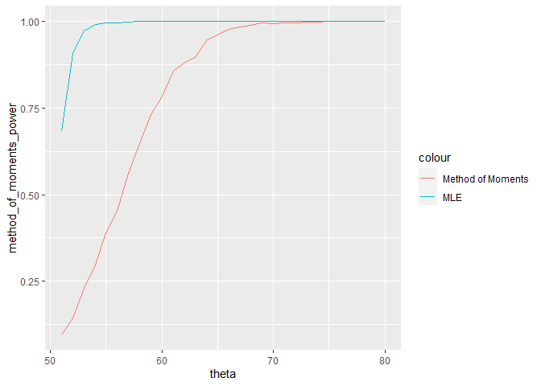
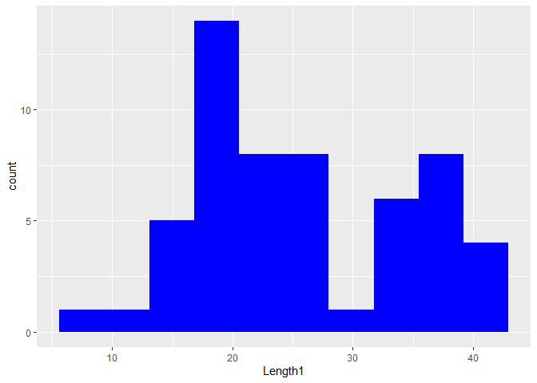
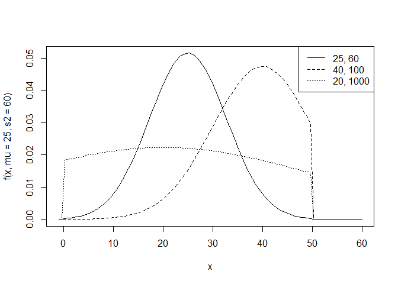

HW03
================
Vy Dang, ivydang

## Question 1 (10 pts)

Consider the distribution given by the density:

$$f(x) = \frac{1}{\theta}, x \in [0, \theta], \theta > 0$$

We saw on the previous homework that we could estimate $\theta$ using:

- Method of Moments: $\tilde \theta = 2 \bar X$
- Maximum Likelihood $\hat \theta = \max_{i} X_i$

In this homework, we will explore the duality between estimators and
test statistics.

### Part (a) (2 pts)

Suppose we wish to test the hypothesis that $\theta = 50$ against the
alternative that $\theta = 51$. We will suppose we have a sample size of
$n = 56$ observations.

$$H_0: \theta = 50 \text{ vs } H_1: \theta = 51$$

As test statistics, we can use the estimators given above.

Suppose the true $\theta = 50$. Find the null distribution for
$\tilde \theta$ (method of moments) under when $\theta = 50$ and the
alternative distribution when $\theta = 51$. Use 10,000 Monte Carlo
replications (i.e., 10,000 samples of 56 observations) .

Find a rejection region of the form $\tilde \theta > c$ such that
$P(\tilde \theta > c \mid H_0) \le 0.05$. Find the power of this region
when $\theta = 51$.

Here’s some code to get you started:

``` r
set.seed(123)
null_samples <- data.frame(replicate(10000, { runif(56, min = 0, max = 50)}))
null_thetas <- sapply(null_samples, function(x) 2*mean(x))
alt_samples  <- data.frame(replicate(10000, { runif(56, min = 0, max = 51)}))
alt_thetas <- sapply(alt_samples, function(x) 2*mean(x))
c <- quantile(null_thetas, 0.95)
power <- mean(alt_thetas > c)
c
```

    ##     95% 
    ## 56.2449

``` r
power
```

    ## [1] 0.0887

``` r
# you can use map_dbl() to compute your test statistic on each sample.
```

### Part (b) (2 pts)

Repeat this process using $\hat \theta$ (the MLE statistic).

``` r
set.seed(123)
null_samples <- data.frame(replicate(10000, { runif(56, min = 0, max = 50)}))
null_thetas <- sapply(null_samples, max)
alt_samples  <- data.frame(replicate(10000, { runif(56, min = 0, max = 51)}))
alt_thetas <- sapply(alt_samples, max)
c <- quantile(null_thetas, 0.95)
power <- mean(alt_thetas > c)
c
```

    ##      95% 
    ## 49.95712

``` r
power
```

    ## [1] 0.6814

### Part (c) (2 pts)

Create a power curve for each method evaluated at the following
alternative distributions. Save some time, feel free to only use 1000
samples (of 56 observations each) per alternative hypothesis.

``` r
set.seed(123)
generate_power_curve <- function(theta_vals, n_samples = 1000, sample_size = 56) {
  method_of_moments_power <- numeric(length(theta_vals))
  mle_power <- numeric(length(theta_vals))
  null_samples <- replicate(10000, runif(sample_size, min = 0, max = 50), simplify = FALSE)
  null_thetas_mom <- sapply(null_samples, function(x) 2 * mean(x))
  null_thetas_mle <- sapply(null_samples, max)
  critical_value_mom <- quantile(null_thetas_mom, 0.95)
  critical_value_mle <- quantile(null_thetas_mle, 0.95)
  
  for (i in seq_along(theta_vals)) {
    theta <- theta_vals[i]
    alt_samples <- replicate(n_samples, runif(sample_size, min = 0, max = theta), simplify = FALSE)
    alt_thetas_mom <- sapply(alt_samples, function(x) 2 * mean(x))
    alt_thetas_mle <- sapply(alt_samples, max)
    
    method_of_moments_power[i] <- mean(alt_thetas_mom > critical_value_mom)
    mle_power[i] <- mean(alt_thetas_mle > critical_value_mle)
  }
  
  return(data.frame(theta = theta_vals, method_of_moments_power, mle_power))
}


theta_power <- 51:80

power_curve <- generate_power_curve(theta_power)
ggplot(power_curve, aes(x=theta)) + geom_line(aes(y=method_of_moments_power, color = "Method of Moments")) +
  geom_line(aes(y = mle_power, color = "MLE"))
```



How large does $\theta$ have to be to achieve $>80$% power for each of
the methods?

``` r
mom_80_power_theta <- min(power_curve$theta[power_curve$method_of_moments_power > 0.8])
mle_80_power_theta <- min(power_curve$theta[power_curve$mle_power > 0.8])
mom_80_power_theta
```

    ## [1] 61

``` r
mle_80_power_theta
```

    ## [1] 52

### Part (d) (2 pts)

Explain your findings in (a) - (c) to an audience that has a background
in statistics but is not familiar with using Monte Carlo integration to
estimate operating characteristics. What would you tell this audience
about these two test statistics.

We are comparing two statistical methods for estimating the parameter
$\theta$ of a uniform distribution Uniform(0,theta) and their
performance in hypothesis testing and power analysis.

Part a:

- We generated samples under the null hypothesis $\theta = 50$ and the
  alternative hypothesis $\theta = 51$.

- For the Method of Moments, we computed the estimator $\tilde{\theta}$
  and determined a critical value where only 5% of the $\tilde{\theta}$
  values (under the null hypothesis) exceed this value.

- Similarly, for the MLE, we calculated the critical value for
  $\hat{\theta}$ under the null hypothesis.

Part b:

We calculated the power of each test statistic (MoM and MLE) for
$\theta = 51$, which is the probability of correctly rejecting the null
hypothesis when it is false. We found that power of MOM is 0.0887 and
power of MLE is 0.6814. Here, MLE has a higher probability of correctly
rejecting the null hypothesis compared to the Method of Moments.

Part c:

- We are considering a range of $\theta$ values (from 51 to 80) to
  create power curves for both MoM and MLE.

- The power curve shows the probability of rejecting the null hypothesis
  for each value of $\theta$.

- Our results: The MLE consistently demonstrates higher power compared
  to the Method of Moments.

- To achieve a power of more than 80%, $\theta$ must be at least: 61 for
  MOM, 52 for MLE

Interpretation of the two test statistics:

- Method of Moments (MoM) estimator $\tilde{\theta}$ is based on the
  sample mean and scales it to estimate $\theta$.

- Maximum Likelihood Estimator (MLE) $\hat{\theta}$ uses the maximum
  observed value in the sample.

Conclusion: Both methods determine thresholds beyond which we would
reject the null hypothesis (critical values), which are higher for MOM
than MLE. MLE outperforms MOM in power analysis which detects the
deviation from the null hypothesis. MLE requires a smaller $\theta$ to
achieve the same power level as MoM. For example, achieving over 80%
power requires $\theta$ to be approximately 61 for MoM, but only around
52 for MLE. If accurate detection of small deviations from the null
hypothesis is crucial, MLE is more powerful and should be preferred, but
it’s also harder to implement in practice.

### Part (e) (2 pts)

This file includes a sample of fish caught by the University of
Helsinki, including their lengths. Using the `length1` measurement and a
test statistic of your choice, test the hypothesis that Perch (species
code 7) are uniformly distributed between 0 and 50cm against the
alternative that they are uniform between 0 and 51cm.

``` r
perch_data <- fish |> filter(Species == 7) |> select(Length1)
# Using MLE to test hypothesis
theta_hat_mle <- max(perch_data, na.rm = TRUE)
set.seed(123)
null_samples_mle <- replicate(10000, runif(length(perch_data), min = 0, max = 50))
null_samples_mle <- matrix(unlist(null_samples_mle), nrow = length(perch_data), byrow = FALSE)
null_thetas_mle <- apply(null_samples_mle, 2, max)
critical_value_mle <- quantile(null_thetas_mle, 0.95)
theta_hat_mle
```

    ## [1] 41.1

``` r
critical_value_mle
```

    ##      95% 
    ## 47.38859

``` r
reject_null_mle <- theta_hat_mle > critical_value_mle
reject_null_mle
```

    ##   95% 
    ## FALSE

## Problem 2 (10 pts)

In the previous problem, we tested a hypothesis that stated that the
distribution of the length of Perch was uniform within the interval
$[0, \theta]$. Plotting out the fish data, we see this assumption may
not seem plausible:

``` r
ggplot(filter(fish, Species == 7), aes(x = Length1)) + geom_histogram(fill = "blue", bins = 10)
```



A slightly more flexible model is given by a **truncated Normal
distribution**:

$$f(x) = I(x \in [0, \theta]) \, c(\mu, \sigma^2, \theta) \, \frac{1}{\sqrt{2\pi \sigma^2}}\exp\left\{ -\frac{(x - \mu)^2}{2\sigma^2} \right\}$$
where $I(x \in [0, \theta])$ is the indicator function for the event
that $x$ is in the region $[0, \theta]$ and $c$ is a function of the
parameters that ensures that $f$ is a valid density function (i.e., it
integrates to 1 over the region $[0, \theta]$).

We’ll fix $\theta = 50$. Here are some example truncated normal
distributions:

``` r
f <- function(x, mu, s2) { 
  const <- 1/(pnorm(50, mean = mu, sd = sqrt(s2)) -
                pnorm(0, mean = mu, sd = sqrt(s2)))
  ifelse(0 <= x & x <= 50,
         const * dnorm(x, mean = mu, sd = sqrt(s2)),
         0
  )  
}
curve(f(x, mu = 25, s2 = 60), from = -1, to  = 60)
curve(f(x, mu = 40, s2 = 100), add = TRUE, lty = 2)
curve(f(x, mu = 20, s2 = 1000), add = TRUE, lty = 3)
legend(x = "topright", legend = c("25, 60", "40, 100", "20, 1000"), lty = 1:3)
```



### Part (a) (2 pts)

Let $Z \sim N(\mu, \sigma^2)$. Let $X$ be a truncated Normal with the
same $\mu$ and $\sigma^2$, but truncated on the interval $[0, \theta]$.

**Prove** that the CDF $F(x) = P(X \le x)$ is equal to:
$$F(x) = I(0 \le x \le \theta) \frac{P(Z \le x) - P(Z \le 0)}{P(Z \le \theta) - P(Z \le 0)} + I(x > \theta)$$

**Compute** the value of $F(30)$ for
$\mu = 40, \sigma^2 = 100, \theta = 50$ (we’ll use this value later)
using `pnorm` to get $P(Z \le z), z = 0, \theta$.

Hint: (a) First explain what role the indicator functions play in the
CDF. (b) Think about $X$ as a **conditional random variable**:
$X = Z \mid (0 \le Z \le \theta)$.

Let $Z \sim N(\mu, \sigma^2)$ and $X$ be a truncated Normal distribution
with parameters $\mu$ and $\sigma^2$, truncated on the interval
$[0, \theta]$.

CDF Proof The CDF of the truncated normal distribution on $[0, \theta]$
is given by:
$$ F(x) = I(0 \le x \le \theta) \frac{P(Z \le x) - P(Z \le 0)}{P(Z \le \theta) - P(Z \le 0)} + I(x > \theta)$$

Explanation of the CDF:

Indicator Functions:

$I(0 \le x \le \theta)$ ensures that the formula within applies only
when (x) is within the interval $[0, \theta]$. $I(x > \theta)$ indicates
that if (x) is greater than $\theta$, then the CDF is 1, since the
truncated normal distribution is defined only up to $\theta$.

Conditional Probability:

The term $\frac{P(Z \le x) - P(Z \le 0)}{P(Z \le \theta) - P(Z \le 0)}$
reflects the rescaling of the normal CDF $P(Z \le x)$ to account for the
truncation.

Since (X) is the truncated version of (Z), (X) assumes values in the
range $[0, \theta]$. Thus:
$$ F(x) = P(X \leq x) = P(Z \leq x \mid 0 \leq Z \leq \theta) = \frac{P(Z \leq x) - P(Z \leq 0)}{P(Z \leq \theta) - P(Z \leq 0)} $$

Calculation of ( F(30) ): Given $\mu = 40$, $\sigma^2 = 100$ so
$\sigma = 10$, and $\theta = 50$:

$$Z \sim N(\mu, \sigma^2)$$

Compute values using the standard normal CDF Phi, which corresponds to
pnorm in R:
$$ F(x) = \frac{\Phi\left(\frac{x - \mu}{\sigma}\right) - \Phi\left(\frac{0 - \mu}{\sigma}\right)}{\Phi\left(\frac{\theta - \mu}{\sigma}\right) - \Phi\left(\frac{0 - \mu}{\sigma}\right)} $$

``` r
mu <- 40
sigma <- 10
theta <- 50
x <- 30
P_Z_le_0 <- pnorm(0, mean = mu, sd = sigma)
P_Z_le_30 <- pnorm(x, mean = mu, sd = sigma)
P_Z_le_50 <- pnorm(theta, mean = mu, sd = sigma)
F_30 <- (P_Z_le_30 - P_Z_le_0) / (P_Z_le_50 - P_Z_le_0)
F_30
```

    ## [1] 0.1885429

### Part (b) (2 pts)

Use Monte Carlo integration to estimate

$$P(X \le 30) = E(I(X \le 30))$$

for $\mu = 40$, $\sigma^2 = 100$, and $\theta = 50$. You can use `rnorm`
to generate random variables $Y \sim N(\mu, \sigma^2$) and then just
keep those that fall into the region $[0, 50]$. You should generate
enough $Y$ so that you have at least 5000 $X$ after discarding $Y$
outside the $[0, 50]$ interval. Create a 95% confidence interval for
$F(30)$. Does your interval include the value you computed in (a)?

``` r
set.seed(123)
mu <- 40
sigma <- 10
theta <- 50
num_samples <- 10000
Y <- rnorm(num_samples, mean = mu, sd = sigma)
X <- Y[Y >= 0 & Y <= theta]
num_valid_samples <- length(X)
while (num_valid_samples<5000){
  additional_Y <- rnorm(num_samples, mean = mu, sd = sigma)
  additional_X <- additional_Y[additional_Y >= 0 & additional_Y <= theta]
  X <- c(X, additional_X)
  num_valid_samples <- length(X)
}
I_X_le_30 <- X <= 30
P_X_le_30_hat <- mean(I_X_le_30)
se <- sqrt(P_X_le_30_hat * (1 - P_X_le_30_hat) / num_valid_samples)
conf_interval <- c(P_X_le_30_hat - 1.96 * se, P_X_le_30_hat + 1.96 * se)
P_X_le_30_hat
```

    ## [1] 0.191358

``` r
conf_interval
```

    ## [1] 0.1829577 0.1997584

My confidence interval does include the value computed in question a.

### Part (c) (2 pts)

The empirical cumulative distribution function is given by
$$\hat F(x) = \frac{1}{n} \sum_{i=1}^n I(X_i \le x)$$

Generate the sampling distribution of $\hat F(30)$ from sample of 56
units from the distribution in part (b):
$(\mu = 40, \sigma^2 = 100, \theta = 50)$. Use 1000 replications of
samples of size 56.

Using the value of $F(30)$ from part (a), estimate the bias and mean
squared error of the sample mean of 56 observations when estimating.
Include a 99% confidence interval for each.

``` r
set.seed(123)

mu <- 40
sigma <- 10
theta <- 50
n <- 56
num_replications <- 1000
F_30_theoretical <- F_30
sample_truncated_normal <- function(n, mu, sigma, theta) {
  Y <- rnorm(10*n, mean = mu, sd = sigma)
  X <- Y[Y >= 0 & Y <= theta]
  while (length(X) < n) {
    additional_Y <- rnorm(10 * n, mean = mu, sd = sigma)
    additional_X <- additional_Y[additional_Y >= 0 & additional_Y <= theta]
    X <- c(X, additional_X)
  }
  return(X[1:n])
}
F_30_empirical <- numeric(num_replications)
for (i in 1:num_replications){
  sample_X <- sample_truncated_normal(n, mu, sigma, theta)
  F_30_empirical[i] <- mean(sample_X <= 30)
}
bias_hat_c <- mean(F_30_empirical) - F_30_theoretical
mse_hat_c <- mean((F_30_empirical - F_30_theoretical)^2)
se_bias_c <- sd(F_30_empirical - F_30_theoretical) / sqrt(num_replications)
se_mse_c <- sd((F_30_empirical - F_30_theoretical)^2) / sqrt(num_replications)
ci_bias_c <- c(bias_hat_c - 2.576 * se_bias_c, bias_hat_c + 2.576 * se_bias_c)
ci_mse_c <- c(mse_hat_c - 2.576 * se_mse_c, mse_hat_c + 2.576 * se_mse_c)
bias_hat_c
```

    ## [1] 0.0005642717

``` r
ci_bias_c
```

    ## [1] -0.003730418  0.004858962

``` r
mse_hat_c
```

    ## [1] 0.002777072

``` r
ci_mse_c
```

    ## [1] 0.002477263 0.003076881

### Part (d) (2 pts)

For truncated Normal distributions where the truncation is not too
asymmetric, another option is to use $\bar X$ to estimate $\mu$ and
$S^2$ (the sample variance) to estimate $\sigma^2$.

Repeat part (c) by estimating $P(X \le 30)$ using the CDF given in part
(a), using $\mu = \bar X$ and $\sigma^2 = S^2$ and $\theta = 50$ as
parameters. Compute the bias and mean squared error for this estimator.

``` r
set.seed(123)
mu <- 40
sigma <- 10
theta <- 50
n <- 56
num_replications <- 1000
F_30_theoretical <- F_30
F_30_empirical <- numeric(num_replications)
for (i in 1:num_replications){
  sample_X <- sample_truncated_normal(n, mu, sigma, theta)
  mu_hat <- mean(sample_X, na.rm = TRUE)
  sigma_hat <- sqrt(var(sample_X, na.rm = TRUE))
  P_Z_le_0 <- pnorm(0, mean = mu_hat, sd = sigma_hat)
  P_Z_le_30 <- pnorm(30, mean = mu_hat, sd = sigma_hat)
  P_Z_le_50 <- pnorm(theta, mean = mu_hat, sd = sigma_hat)
  
  F_30_empirical[i] <- (P_Z_le_30 - P_Z_le_0) / (P_Z_le_50 - P_Z_le_0)
}
bias_hat_d <- mean(F_30_empirical) - F_30_theoretical
mse_hat_d <- mean((F_30_empirical - F_30_theoretical)^2)
se_bias_d <- sd(F_30_empirical - F_30_theoretical) / sqrt(num_replications)
se_mse_d <- sd((F_30_empirical - F_30_theoretical)^2) / sqrt(num_replications)
ci_bias_d <- c(bias_hat_d - 2.576 * se_bias_d, bias_hat_d + 2.576 * se_bias_d)
ci_mse_d <- c(mse_hat_d - 2.576 * se_mse_d, mse_hat_d + 2.576 * se_mse_d)
bias_hat_d
```

    ## [1] 0.006393936

``` r
ci_bias_d
```

    ## [1] 0.00233702 0.01045085

``` r
mse_hat_d
```

    ## [1] 0.00251868

``` r
ci_mse_d
```

    ## [1] 0.002240215 0.002797146

### Part (e) (2 pts)

Using either the estimator from (c) or (d), estimate $P(X \le 30)$
(assuming $\theta = 50$) for the fish data. Why did you pick this
estimator? Compare the two estimators in (c) and (d) on bias and MSE.

``` r
set.seed(123)
mu <- 40
sigma <- 10
theta <- 50
n <- 56
num_replications <- 1000
fish_data <- fish %>% filter(Species == 7) %>% pull(Length1)
mu_hat_fish <- mean(fish_data, na.rm = TRUE)
sigma_hat_fish <- sqrt(var(fish_data, na.rm = TRUE))
P_Z_le_0_fish <- pnorm(0, mean = mu_hat_fish, sd = sigma_hat_fish)
P_Z_le_30_fish <- pnorm(30, mean = mu_hat_fish, sd = sigma_hat_fish)
P_Z_le_50_fish <- pnorm(50, mean = mu_hat_fish, sd = sigma_hat_fish)
P_X_le_30_fish <- (P_Z_le_30_fish - P_Z_le_0_fish) / (P_Z_le_50_fish - P_Z_le_0_fish)
P_X_le_30_fish
```

    ## [1] 0.6919659

Bias: Estimator (c) has a smaller bias ((0.00056)) compared to estimator
(d) ((0.0064)). MSE: Estimator (d) has a smaller MSE ((0.0025)) compared
to estimator (c) ((0.00278)). Here I use estimator (d). I would
generally prefer the estimator with the smaller MSE because it accounts
for both variance and bias. Thus, estimator (d) is preferable due to its
lower MSE so it provides more reliable estimates overall.
