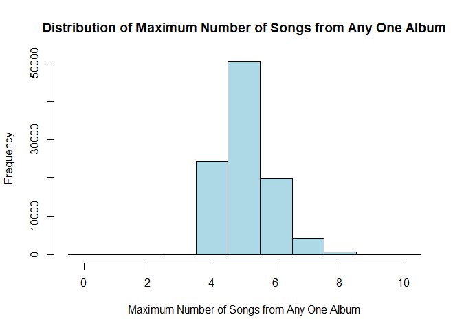

HW04
================
Vy Dang, ivydang

## Problem 1 (10 points)

In this problem we will create a confidence interval for the median of a
Cauchy distribution.

As we saw in class, the Cauchy distribution has a density function given
by:

$$f(x) = \frac{1}{\pi[1 + (x - \theta)^2]}$$

where $\theta$ is the location parameter.

### Part (a) (2 pt)

Prove $\theta$ is the median of the Cauchy distribution.

Hint: Use a change of variables and the fact that
$\frac{d}{dz} \arctan(z) = \frac{1}{1 + z^2}$.

To prove that $\theta$ is the median of the Cauchy distribution, we need
to show that $P(X \leq theta) = 0.5$

Given the probability density function (pdf) of the Cauchy distribution:
$f(x) = \frac{1}{\pi[1 + (x - \theta)^2]}$

To find the cumulative distribution function (CDF), we integrate the pdf
from $-\infty$ to (x):
$F(x) = \int_{-\infty}^{x} \frac{1}{\pi[1 + (t - \theta)^2]} , dt$

We have: $u = t - \theta$, so $dt=du$. When $t = -\infty$,
$u = -\infty$. When $t = x$, $u = x - \theta$. So we have the integral:
$F(x) = \int_{-\infty}^{x-\theta} \frac{1}{\pi[1 + u^2]} , du$

We know that: $\frac{d}{du} \arctan(u) = \frac{1}{1 + u^2}$

So,
$F(x) = \frac{1}{\pi} \int_{-\infty}^{x-\theta} \frac{1}{1 + u^2} du = \frac{1}{\pi} \left[ \arctan(u) \right]_{-\infty}^{x-\theta}$

Evaluating the arctangent at the limits:
$F(x) = \frac{1}{\pi} \left[ \arctan(x-\theta) - \arctan(-\infty) \right]$

Since
$\arctan(-\infty) = -\frac{\pi}{2},  F(x) = \frac{1}{\pi} \left[ \arctan(x-\theta) + \frac{\pi}{2} \right]$

Thus, the cumulative distribution function is:
$F(x) = \frac{1}{\pi} \arctan(x - \theta) + \frac{1}{2}$ The median (m)
satisfies: $F(m) = 0.5$

Setting the CDF equal to 0.5, we get:
$\frac{1}{\pi} \arctan(m - \theta) + \frac{1}{2} = 0.5$

$\arctan(m - \theta):  \frac{1}{\pi} \arctan(m - \theta) = 0$

Since (0) times $\pi$ is (0), we have: $\arctan(m - \theta) = 0$

The arctangent function evaluates to 0 when its argument is 0:
$m - \theta = 0$

$m = \theta$

### Part (b) (2 pt)

Using Monte Carlo techniques set up a hypothesis test with a null
hypothesis that $\theta = 0$ against the alternative that
$\theta \ne 0$. Use a sample size of $n = 100$ and a significance level
of $\alpha = 0.05$.

Generate draws from alternative distributions when (a) $\theta = 1$ and
(b) $\theta = -1$. Use this to pick a rejection region that is the union
of two rejection regions of equal size $\alpha/2$.

Reminder, the function `rcauchy` will generate random samples from the
Cauchy distribution.

``` r
set.seed(42)
n <- 100
alpha <- 0.05
M <- 10000
null_samples <- replicate(M, median(rcauchy(n, location = 0)))
lower_critical <- quantile(null_samples, alpha/2)
upper_critical <- quantile(null_samples, 1-alpha/2)
lower_critical 
```

    ##      2.5% 
    ## -0.319318

``` r
upper_critical
```

    ##     97.5% 
    ## 0.3111064

``` r
test_sample <- function(sample, lower_critical, upper_critical){
  sample_median <- median(sample)
  return(sample_median < lower_critical || sample_median > upper_critical)
}
# For theta = 1
alt_sample_theta_1 <- replicate(M, test_sample(rcauchy(n, location = 1), 
                                               lower_critical, upper_critical))
rejection_rate_theta_1 <- mean(alt_sample_theta_1)
# For theta = -1
alt_sample_theta_minus_1 <- replicate(M, test_sample(rcauchy(n, location = -1), 
                                                     lower_critical, upper_critical)) 
rejection_rate_theta_minus_1 <- mean(alt_sample_theta_minus_1)

rejection_rate_theta_1
```

    ## [1] 1

``` r
rejection_rate_theta_minus_1
```

    ## [1] 1

### Part (c) (2 pt)

Using your code developed in part (b), write a function that given a
sample size $n$, a significance level $\alpha$, and a location parameter
$\theta_0$ will return the acceptance region for the null hypothesis
that $\theta = \theta_0$.

Test your function with $n = 100$, $\alpha = 0.05$, and $\theta_0 = 0$.

``` r
# Function to determine acceptance region
get_acceptance_region <- function(n, alpha, theta_0, M=10000){
  null_samples <- replicate(M, median(rcauchy(n, location = 0)))
  lower_critical <- quantile(null_samples, alpha/2)
  upper_critical <- quantile(null_samples, 1-alpha/2)
  return(c(lower_critical, upper_critical))
}
n <- 100
alpha <- 0.05
theta_0 <- 0
get_acceptance_region(n, alpha, theta_0)
```

    ##       2.5%      97.5% 
    ## -0.3176400  0.3130841

### Part (d) (4 pt)

Using the test inversion method of confidence interval construction,
write a function that will return a confidence interval for the median
of the Cauchy distribution given a sample and a confidence coefficient.
The method requires that you test a range of values for $\theta$. Test
100 values from the minimum value of the sample to the maximum value of
the sample.

``` r
set.seed(406460406)
n <- 25
x <- rcauchy(n, location = 7)
y <- rcauchy(2 * n, location = 3)
test_theta <- function(sample, theta_0, alpha, M = 10000) {
  n <- length(sample)
  acceptance_region <- get_acceptance_region(n, alpha, theta_0, M)
  sample_median <- median(sample)
  return(sample_median >= acceptance_region[1] && sample_median <= acceptance_region[2])
}

confidence_interval <- function(sample, confidence_level, num_theta_values = 100, M = 10000) {
  alpha <- 1 - confidence_level
  range_min <- min(sample) - 1
  range_max <- max(sample) + 1
  theta_range <- seq(min(sample), max(sample), length.out = num_theta_values)
  accepted_theta <- sapply(theta_range, test_theta, sample = sample, alpha = alpha, M = M)
  lower_bound <- min(theta_range[accepted_theta])
  upper_bound <- max(theta_range[accepted_theta])
  return(c(lower_bound, upper_bound))
}
confidence_level <- 0.95
ci_x <- confidence_interval(x, confidence_level)
```

    ## Warning in min(theta_range[accepted_theta]): no non-missing arguments to min;
    ## returning Inf

    ## Warning in max(theta_range[accepted_theta]): no non-missing arguments to max;
    ## returning -Inf

``` r
ci_y <- confidence_interval(y, confidence_level)
```

    ## Warning in min(theta_range[accepted_theta]): no non-missing arguments to min;
    ## returning Inf

    ## Warning in min(theta_range[accepted_theta]): no non-missing arguments to max;
    ## returning -Inf

## Problem 2 (6 points)

Suppose we are sampling independent observations $X_i$ from a
distribution for which we assume
$$\text{E}(X) < \infty, \quad \text{E}(X^2) < \infty$$ so that the
Central Limit Theorem will apply. Writing $\mu = \text{E}(X)$ and
$\sigma^2 = \text{E}((X - \mu)^2)$, the CLT states that for large
samples the following approximation holds:
$$\bar X \sim N(\mu, \sigma^2/n)$$ A corollary of the CLT is that we
have (approximately), $$\frac{\bar X - \mu}{s/\sqrt{n}} \sim t(n - 1)$$
where $s$ is the square root of the sample variance and $t(d)$ is the
$t$-distribution with $d$ degrees of freedom. As we saw in class, this
gives rise to $(1 - \alpha) \times 100\%$ confidence intervals defined
by the set of (two-sided) hypothesis tests that would not be rejected at
the $\alpha$ level: $$\bar X \pm t_{\alpha/2}(n - 1) s/\sqrt{n}$$

If $\bar X$ were really Normal, this relationship would hold exactly
(which would only occur when the $X_i$ are themselves Normal), but the
rest of the time it is simply an approximation. Let’s test how well it
works in some specific cases.

For each problem, generate 10,000 samples (each of size $n$, given
below) and compute a 95% confidence interval. Estimate the confidence
coefficient (i.e., $P(\mu \in \bar X \pm t_{0.975}(19) s/\sqrt{20})$)
and provide a 99% CI for the confidence coefficient itself (use
`binom.test`).

### Part (a) (2 pt)

The Laplace distribution (also known as the “double exponential
distribution”) is given by:

$$f(x) = \frac{1}{2} \exp\left\{ -\left| x - \mu \right| \right\}$$ and
can be generated using the following function:

``` r
rlaplace <- function(n, mean) {
  s <- 2 * rbinom(n, size = 1, p = 0.5) - 1
  m <- rexp(n) 
  s * m + mean
}
```

Estimate the coverage rate for a 95% two-sided confidence interval (use
`t.test`) from samples drawn from:

$$n = 20, X_i \sim \text{Laplace}(1/2), \text{E}(X) = 1/2$$

``` r
set.seed(123)
n <- 20
mu <- 1/2
nsim <- 10000
coverage_count <- 0
for (i in 1:nsim){
  sample <- rlaplace(n, mean = mu)
  t_test <- t.test(sample, mu = mu)
  ci.lower <- t_test$conf.int[1]
  ci.upper <- t_test$conf.int[2]
  if (mu >= ci.lower && mu <= ci.upper){
    coverage_count <- coverage_count + 1
  }
}
coverage_rate <- coverage_count / nsim
binom_ci <- binom.test(coverage_count, nsim, conf.level = 0.99)
```

### Part (b) (2 pt)

Compare two different sample sizes (see `rexp` to generate your
samples):

$$n = 20, X_i \sim \text{Exp}(2), \text{E}(X) = 1/2$$

$$n = 500, X_i \sim \text{Exp}(2), \text{E}(X) = 1/2$$

``` r
set.seed(123)
estimate_coverage_rate <- function(n, mu, nsim = 10000){
  coverage_count <- 0
  for (i in 1:nsim){
  sample <- rlaplace(n, mean = mu)
  t_test <- t.test(sample, mu = mu)
  ci.lower <- t_test$conf.int[1]
  ci.upper <- t_test$conf.int[2]
  if (mu >= ci.lower && mu <= ci.upper){
    coverage_count <- coverage_count + 1
  }
}
coverage_rate <- coverage_count / nsim
binom.ci <- binom.test(coverage_count, nsim, conf.level = 0.99)
return(list(coverage_rate = coverage_rate, ci = binom_ci$conf.int))
}
mu <- 1/2
nsim <- 10000
results_n20 <- estimate_coverage_rate(n = 20, mu = mu, nsim = nsim)
results_n500 <- estimate_coverage_rate(n = 500, mu = mu, nsim = nsim)
results_n20
```

    ## $coverage_rate
    ## [1] 0.9541
    ## 
    ## $ci
    ## [1] 0.9484395 0.9593231
    ## attr(,"conf.level")
    ## [1] 0.99

``` r
results_n500
```

    ## $coverage_rate
    ## [1] 0.9516
    ## 
    ## $ci
    ## [1] 0.9484395 0.9593231
    ## attr(,"conf.level")
    ## [1] 0.99

What do you notice?

For small sample sizes (n = 20), The estimated coverage rate is 0.9541,
which is slightly above the nominal confidence level of 95%, good
coverage but slight deviations from the nominal rate can occur due to
the larger variability. For larger sample size (n = 500), the estimated
coverage rate is 0.9516, which is very close to the nominal confidence
level of 95%, indicating that the approximation provided by the
t-distribution works very well. Both the confidence intervals for n=20
and n=500 are very tight and centered around the estimated coverage
rates.

### Part (c) (2 pt)

Discuss the following “rule of thumb”: For any sample size greater than
30, we are safe to approximate the distribution of the sample mean as
Normally distributed. Do you agree with this rule of thumb? Why or why
not?

Yes I agree with this rule of thumb but with reservations. This provides
a simple and easy-to-remember guideline for us which makes it accessible
for general use without the need for complex statistical assessments.
Here we can have a quick reference point to decide whether using
normal-based methods (like the t-test or z-test) is appropriate. When
the underlying data is not heavily skewed or does not have extreme
outliers, this rule is sufficient. However, for distributions with high
skewness, heavy tails, or significant kurtosis, a sample size of 30 may
not be large enough to achieve a normal approximation. Also CLT assumes
that the underlying distribution has finite mean and variance. If these
conditions are not met (for example with distributions that have
infinite variance like Cauchy), I think even very large sample sizes
might not lead to a normally distributed sample mean.

## Problem 3 (4 points)

### Part (a) (2 pt)

Read the paper “Does Your iPod Really Play Favorites?”

Briefly summarize the paper overall and give an explanation of how Monte
Carlo methods were used in section 3.3.

The paper investigates the randomness of the shuffle feature on iPod
devices. Users have often questioned the randomness, citing anecdotal
evidence of seemingly non-random behavior. The paper aims to examine
these claims using probabilistic models and statistical analyses. The
authors explore various phenomena perceived as evidence of
non-randomness, such as the frequency and clusters of songs by
particular artists in a shuffled playlist. The paper reviews existing
research on human perception of randomness, highlighting that people
often incorrectly assume short-run randomness should reflect long-term
expectations and tend to remember surprising coincidences, which
distorts their perception of random behavior. The authors develop
probability models for different events cited as evidence of a
non-random shuffle, such as the time before a particular song or artist
appears in the shuffle, the number of songs from a specific group within
a short duration, and clusters of songs from specific albums. The paper
employs goodness-of-fit tests using data collected from real iPod
shuffles to determine whether observed patterns deviate from the
expected patterns under the assumption of randomness.

Section 3.3 of the paper deals with the probabilities concerning the
maximum number of songs from any album appearing in a fixed number of
songs selected to fill an iPod Shuffle. This is in response to users’
claims that the shuffle feature sometimes includes an unexpectedly high
number of songs from the same album. First the authors define the event
of interest as obtaining three or more songs from any album when 120
songs are randomly selected from a playlist of 3,000 songs, each album
containing 12 songs (250 albums, 12 songs each, 3000 songs total
hypothetically). To find the probability of having a maximum of three or
more songs from any album, they compute the complementary probabilities
of having at most two songs from any album. They simulate the random
selection of 120 songs from the playlist (each shuffle is an independent
trial) multiple times (100,000 trials) to estimate the probability
distribution empirically. In each trial, the number of songs selected
from each album is recorded, and the maximum number of songs from any
album is noted. They use this simulated data to tally the frequency of
different maximum values and thus estimate the probability of observing
specific outcomes, like having three or more songs from any album out of
the 120 selected. The simulation indicates that the event described by
users (having three or more songs from the same album) is expected to
occur quite frequently.

### Part (b) (2 pt)

Write a simulation that replicates the use of Monte Carlo techniques in
3.3. Here is a data set of songs, grouped by album.

``` r
set.seed(987987)
n_albums <- 81
songs_per_album <- rpois(n_albums, 10)
artist_per_album <- sample(1:50, n_albums, replace = TRUE)

songs <- tibble(
  album = rep(1:n_albums, times = songs_per_album),
  artist = rep(artist_per_album, times = songs_per_album),
  song = 1:sum(songs_per_album)
)

## example of a sample of size 120 
## and counting the number of songs by each artist in the sample
sample_songs <- sample_n(songs, 120)
table(sample_songs$artist)
```

    ## 
    ##  1  2  7  8 10 12 13 14 15 17 19 20 22 23 24 25 26 28 29 30 32 33 34 35 36 37 
    ##  4  1  4  4  4  2  3  4 13  2  4  8  1  3  3  6  3  3  3  5  4  3  5  1  4  3 
    ## 38 40 41 42 43 44 46 47 49 50 
    ##  4  2  2  1  2  1  3  1  2  2

``` r
perform_simulation <- function(songs, sample_size, n_simulations){
  max_songs_per_album <- numeric(n_simulations)
  for (i in 1:n_simulations){
    sample_songs <- sample_n(songs, sample_size)
    count_per_album <- table(sample_songs$album)
    max_songs_per_album[i] <- max(count_per_album)
  }
  return(max_songs_per_album)
}
sample_size <- 120
n_simulations <- 100000 
max_songs_per_album <- perform_simulation(songs, sample_size, n_simulations)
estimated_probabilities <- table(max_songs_per_album) / n_simulations
hist(max_songs_per_album, breaks = seq(0, max(max_songs_per_album) + 1) - 0.5,
     main = "Distribution of Maximum Number of Songs from Any One Album",
     xlab = "Maximum Number of Songs from Any One Album",
     ylab = "Frequency",
     col = "lightblue")
```


