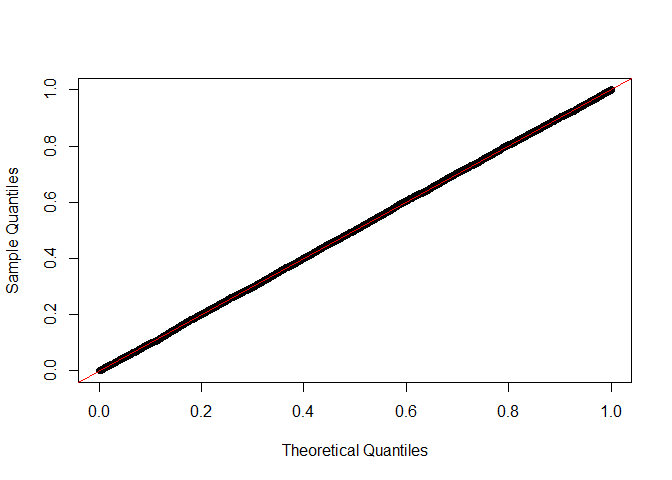
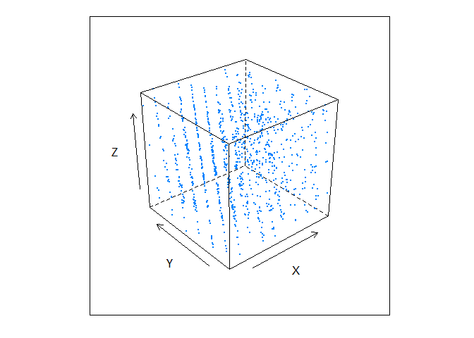
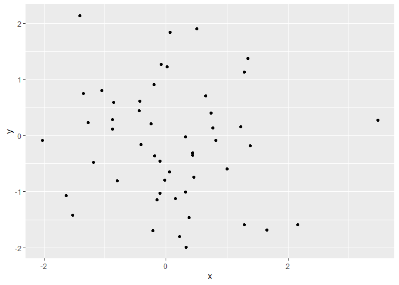
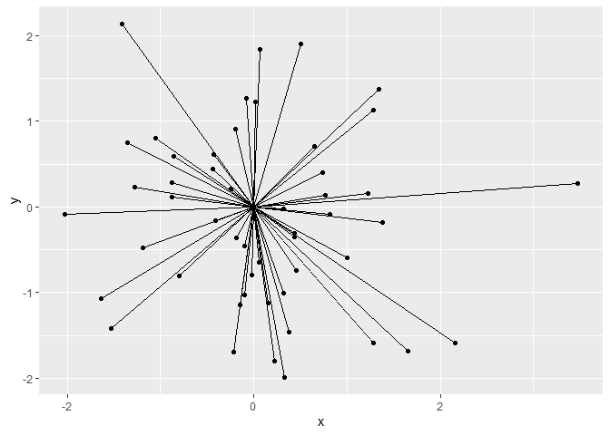
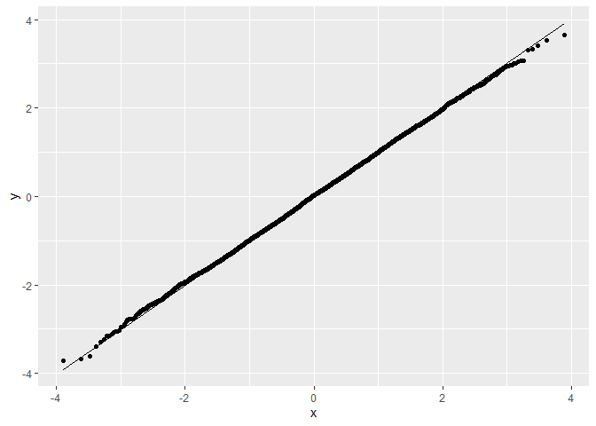
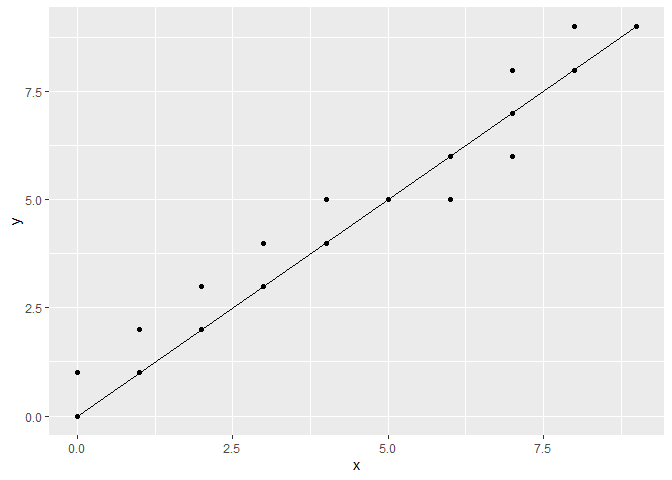

HW05
================
Vy Dang, ivydang

## Problem 1 (2 pts)

### Part (a) (1 pt)

Here is the expression for a pseudorandom number generator that was used
on a particular version of the VAX VMS operating system. It produces
numbers between 0 and $2^{31} - 1$

$$r(s) = \left( s \times (2^{16} + 3)\right) \mod 2^{31} $$

This particular random number generator was notorious for producing poor
quality of random numbers.

Implement a version of this random number generator that returns a
single value and then use that to return `n` random integers

``` r
bad_rand_int <- function(seed) {
  return((seed * (2^16+3)) %% 2^31)
}

bad_rand_ints <- function(seed, n) {
  numbers <- numeric(n)
  current_seed <- seed
  for (i in 1:n) {
    current_seed <- bad_rand_int(current_seed)
    numbers[i] <- current_seed
  }
  return(numbers)
}
```

Using your function `bad_rand_ints`, starting from a seed of 406
generate 10 random values. Do you notice anything that would suggest
these numbers are not uniformly random over the set 0 to $2^{31} - 1$?
(Hint: think of classes of numbers you would expect to see in known
proportions – do you see these classes appearing correctly?)

``` r
set.seed(406)
bad_rand_ints(406, 10)
```

    ##  [1]   26608834  159649350  718416594  726171766   38764898  139494438
    ##  [7]  488082546 1673045334 1350561794 1635897350

Most of the numbers end with 4,0, or 6. There are 2 numbers ending with
8. No numbers end with 1, 2, 3, 5, 7, or 9. In a perfectly uniform
distribution, each digit from 0 to 9 should have a frequency of 1 (since
10 values are generated and there are 10 possible last digits). This may
show that this particular random number generator used on the VAX VMS
operating system produces numbers that are not uniformly random over the
set 0 to 2^31-1.

Now write a function that uses `bad_rand_ints` to produce a vector
containing `n` psuedorandom $U(0,1)$ values.

``` r
bad_rand_u01 <- function(seed, n) {
  random_ints <- bad_rand_ints(seed, n)
  u01 <- random_ints / (2^31 - 1)
  return(u01)
}
```

Draw 10,000 random numbers and make a Q-Q plot compared to the uniform
distribution.

``` r
set.seed(406)
u_vals <- bad_rand_u01(406, 10000)
qqplot(qunif(ppoints(10000)), u_vals, xlab="Theoretical Quantiles", ylab="Sample Quantiles")
abline(0, 1, col = 'red')
```



### Part (b) (1 pt)

While a sequence of PRNGs might look OK when viewed *marginally*,
viewing the sequences as points in a space can be useful to detect
non-random patterns.

When you are ready, the following code will produce a plot when called
on your collection of 10,000 $U(0,1)$ random numbers from the previous
part. What pattern do you see?

``` r
plot_bad_rands <- function(prngs) {
  if (length(prngs) %% 10 != 0) {
    stop("We must have random numbers in a multiple of 10")
  }
  # group the random numbers into groups of 10, but only use the first 3 in each group
  m <- matrix(prngs, ncol = 10, byrow = TRUE)[, 1:3]
  
  # label the columns 
  colnames(m) <- c("X", "Y", "Z")
  
  cloud(Z ~ X + Y, as.data.frame(round(m, 3)), pch = 20, cex = 0.1)
}

plot_bad_rands(u_vals)
```



The points do not look uniformly spread and might exhibit some form of
pattern or clustering which implies non-random behavior. There’s
grid-like, structured patterns on the left hand side, which looks like
lines. On the right hand side the points look more randomly spread.
Ideally, if the PRNG is good, the points should be uniformly and
randomly spread throughout the 3D space.

## Problem 2 (6 pts)

Recall the exponential distribution with mean $\theta^{-1}$ has density:
$$f(x) = \theta e^{- \theta x}$$

### Part (a) (2 pt)

Find the quantile function of an exponential with rate parameter
$\theta$.

CDF $F(x)$ of the exponential distribution.

PDF of an exponential distribution with rate parameter $\theta$ is:
$f(x) = \theta e^{-\theta x} \quad \text{for } x \ge 0$

The CDF is obtained by integrating the PDF from 0 to $x$:
$F(x) = \int_0^x \theta e^{-\theta t} \, dt$

Let $u = -\theta t$, so $du = -\theta \, dt$ results in a change of
limits:
$F(x) = \int_0^x \theta e^{-\theta t} \, dt = \left. -e^{-\theta t} \right|_0^x = 1 - e^{-\theta x}$
$F(x) = 1 - e^{-\theta x} \quad \text{for } x \ge 0$

The quantile function $Q(p)$ is the inverse of the CDF. If $F(x) = p$,
then $Q(p) = x$.

Set the CDF equal to $p$: $F(x) = 1 - e^{-\theta x} = p$
$$1 - e^{-\theta x} = p \\
   e^{-\theta x} = 1 - p \\
   -\theta x = \ln(1 - p) \\
   x = -\frac{1}{\theta} \ln(1 - p)$$

$Q(p) = -\frac{1}{\theta} \ln(1 - p)$

### Part (b) (2 pt)

You may recall that the mean and standard deviation of
$\text{Exp}(\theta)$ is $\mu = \sigma = 1/\theta$. But what is the skew?
$$\gamma = \text{E}\left[\left(\frac{X - \mu}{\sigma}\right)^3\right]$$
Use the quantile function from (a) to sample 10,000 exponential random
variables with rate parameter 2. Estimate $\gamma$ and provide a 99.9%
confidence interval.

``` r
library(MASS)
```

    ## Warning: package 'MASS' was built under R version 4.2.1

    ## 
    ## Attaching package: 'MASS'

    ## The following object is masked from 'package:dplyr':
    ## 
    ##     select

``` r
theta <- 2
n <- 10000
Q <- function(p, theta) {
  -1/theta * log(1-p)
}
set.seed(123)
p_values <- runif(n)
samples <- Q(p_values, theta)
mu <- mean(samples)
sigma <- sd(samples)
skewness <- mean(((samples - mu) / sigma)^3)
boot_skewness <- function(data, indices) {
  d <- data[indices]
  mu_b <- mean(d)
  sigma_b <- sd(d)
  return(mean(((d - mu_b) / sigma_b)^3))
}
set.seed(123)
boot_results <- boot::boot(samples, statistic = boot_skewness, R = 10000)
ci <- boot::boot.ci(boot_results, conf = 0.999, type = "perc")
boot_results
```

    ## 
    ## ORDINARY NONPARAMETRIC BOOTSTRAP
    ## 
    ## 
    ## Call:
    ## boot::boot(data = samples, statistic = boot_skewness, R = 10000)
    ## 
    ## 
    ## Bootstrap Statistics :
    ##     original       bias    std. error
    ## t1* 2.059101 -0.002777167  0.08125669

``` r
ci
```

    ## BOOTSTRAP CONFIDENCE INTERVAL CALCULATIONS
    ## Based on 10000 bootstrap replicates
    ## 
    ## CALL : 
    ## boot::boot.ci(boot.out = boot_results, conf = 0.999, type = "perc")
    ## 
    ## Intervals : 
    ## Level     Percentile     
    ## 99.9%   ( 1.787,  2.343 )  
    ## Calculations and Intervals on Original Scale
    ## Some percentile intervals may be unstable

### Part (c) (2 pts)

Use your results from (a) to prove that if $U \sim U(0, 1)$ then,
$$- \frac{1}{\theta} \log(U) \sim \text{Exp}(\theta), \theta > 0$$
(Where $\log$ is the natural logarithm as always in this class.)

Let $U$ be a random variable that is uniformly distributed on $(0, 1)$.
That is, $U \sim U(0, 1)$.

CDF of $U(0, 1)$: $$
F_U(u) = u \quad \text{for } 0 < u < 1
$$ The CDF of an exponential distribution with rate parameter $\theta$:
$$
F_X(x) = 1 - e^{-\theta x} \quad \text{for } x \ge 0
$$

Quantile function or inverse CDF of the exponential distribution : $$
Q(p) = -\frac{1}{\theta} \log(1 - p)
$$

For $p \sim U(0, 1)$, the quantile function $Q(p)$ gives an exponential
random variable.

Since $U$ is uniformly distributed on $(0, 1)$, we have: $$
 -\frac{1}{\theta} \log(U) \quad \text{produces a sample from } \text{Exp}(\theta)
$$

CDF of the transformed variable $Y = -\frac{1}{\theta} \log(U)$:

Let $Y = -\frac{1}{\theta} \log(U)$, where $U \sim U(0, 1)$.

CDF of $Y$: $$
F_Y(y) = P(Y \le y)
$$

We substitute $Y$ back in terms of $U$: $$
F_Y(y) = P\left( -\frac{1}{\theta} \log(U) \le y \right)
$$

$$
-\frac{1}{\theta} \log(U) \le y \implies \log(U) \ge -\theta y \implies U \le e^{-\theta y}
$$

Since $U \sim U(0, 1)$, we have: $$
F_Y(y) = P(U \le e^{-\theta y}) = e^{-\theta y} \quad \text{for } y \ge 0
$$

$$
F_X(x) = 1 - e^{-\theta x} = e^{-\theta y} \quad \text{for } x \ge 0
$$ So we have $$
F_Y(y) = 1 - e^{-\theta y}
$$

## Problem 3 (8 pts)

The standard Normal distribution:
$$f(x) = \frac{1}{\sqrt{2\pi}} \exp\{ -x^2/2 \}$$ does not have a closed
form quantile function, so it would be difficult to apply the inversion
method. Instead, we can use a transformation method that still only uses
$U(0,1)$ random variables.

### Part (a) (2 pt)

Consider two **independent** standard Normal variables $X$ and $Y$. We
can think of these as points on a Cartesian plane:

``` r
xy <- ggplot(data.frame(x = rnorm(50), y = rnorm(50)), aes(x = x, y = y)) + geom_point()
print(xy)
```



We could also think about these points using **polar coordinates** based
on a radius (distance from the origin) $R = \sqrt{X^2 + Y^2}$ and angle
(from 0 to $2\pi$) such that $\cos(A) = X / R$ and $\sin(A) = Y / R$:

``` r
xy + geom_segment(aes(xend = 0, yend = 0))
```



What is $R^2$? [Use this list of common
relationships](https://en.wikipedia.org/wiki/Relationships_among_probability_distributions)
to express $R^2$ as an **exponential random variable** (since
exponentials can be parameterized using **rate** or **mean**, use the
rate parameterization $W \sim \text{Exp}(\theta)$, $E(X) = 1/\theta$).

We have: $$
   R = \sqrt{X^2 + Y^2}
   $$ $$
   R^2 = X^2 + Y^2
   $$ where - $X$ and $Y$ are independent standard normal variables with
$X \sim N(0,1)$ and $Y \sim N(0,1)$.

$$ X^2 + Y^2 \sim \chi^2_2 \sim \text{Gamma}(1, 2)$$

$$
R^2 = X^2 + Y^2 \sim \chi^2_2 \sim \text{Gamma}(1, 2) \sim \text{Exp}\left(\frac{1}{2}\right)
$$

So the random variable $R^2$ is exponentially distributed with rate
parameter $\theta = 1/2$:

$$
{R^2 \sim \text{Exp}\left(\frac{1}{2}\right)}
$$

$R^2$ is an exponential random variable with mean $2$ and rate
$\frac{1}{2}$.

### Part (b) (2 pt)

Show that the joint distribution for two independent standard Normal
random variables is proportional to the joint distribution for a
$A \sim U(0, 2\pi)$ and the $R^2$ you found in (a), where $A$ and $R^2$
are independent.

We have: $$
f_{X,Y}(x,y) = f_X(x) f_Y(y) = \frac{1}{\sqrt{2\pi}} e^{-x^2/2} \cdot \frac{1}{\sqrt{2\pi}} e^{-y^2/2} = \frac{1}{2\pi} e^{-(x^2 + y^2)/2}
$$

Convert $X$ and $Y$ to polar coordinates: - $R = \sqrt{X^2 + Y^2}$ -
$A = \arctan(Y/X)$

The Jacobian determinant for the transformation from Cartesian
coordinates $(x, y)$ to polar coordinates $(r, a)$ is: $$
\left| J \right| = r
$$

$$
f_{R,A}(r,a) = f_{X,Y}(r \cos a, r \sin a) \left| J \right|
$$

$$
f_{R,A}(r, a) = \frac{1}{2\pi} e^{-(r^2 \cos^2 a + r^2 \sin^2 a)/2} \cdot r
$$

Since $\cos^2 a + \sin^2 a = 1$: $$
f_{R,A}(r,a) = \frac{1}{2\pi} e^{-r^2/2} \cdot r
$$

$$
f_{R,A}(r,a) = \frac{1}{2\pi} r e^{-r^2/2}
$$

where $r \geq 0$ and $a \in [0, 2\pi)$.

We have: $$
f_{R,A}(r,a) = \left(\frac{1}{2\pi}\right) \cdot \left( r e^{-r^2/2} \right)
$$

- $\frac{1}{2\pi}$ is the density of $A \sim U(0, 2\pi)$.
- $r e^{-r^2/2}$ is the density for $R$ with a transformation to $R^2$.

From part a we have: $R^2 \sim \text{Exp}(\frac{1}{2})$. Let $R^2 = W$,
then the density function of $W$ is: $$
f_W(w) = \frac{1}{2} e^{-w/2}
$$

$$
W = R^2 \implies w = r^2 \implies dw = 2r dr
$$

$$
f_R(r) = \frac{1}{2} e^{-r^2/2} \cdot 2r = r e^{-r^2/2}
$$ So we proved that $$
f_{R,A}(r,a) = f_A(a) f_R(r)
$$

$$
{f_{X,Y}(x,y) \propto f_{R,A}(r,a)}
$$

### Part (c) (2 pt)

Use the result from 3(c) that
$-(1/\theta) \log(U) \sim \text{Exp}(\theta)$ along with the identity
$X = R \cos(A)$ to show how to generate one standard Normal random
variable from two independent $U(0,1)$ random variables. (Interesting
note, you can also use $Y = R \sin(A)$ to get a second standard Normal,
which is also independent, but this is not necessary to show.)

``` r
generate_standard_normal <- function() {
  U1 <- runif(1)
  U2 <- runif(1)
  R <- sqrt(-2 * log(U1))
  A <- 2 * pi * U2
  X <- R * cos(A)
  return(X)
} 
generate_standard_normal()
```

    ## [1] -1.057168

### Part (d) (2 pt)

Implement your part (c) in R. Demonstrate your results using a
quantile-quantile plot (replacing `rnorm` with your solution.)

``` r
n <- 10000
standard_normals <- replicate(n, generate_standard_normal())
ggplot(data.frame(x = standard_normals), aes(sample = x)) + geom_qq() + geom_qq_line()
```



## Problem 4 (4 pt)

### Part (a) (2 points)

In class we proved that the inversion method works in the continuous
case. Prove that it works in the discrete case as well. Two useful
facts:

- For any discrete on any domain, there is is a one-to-one mapping from
  that domain to the integers (or a subset of the integers). So without
  loss of generality, we can assume all discrete RVs have the integers
  as their support.
- Let the discrete random variable $X$ be defined on the set $\Omega$.
  If $P(X = x) = P(Y = x)$ for all $x \in \Omega$, then $X$ and $Y$ have
  the same distribution.

To prove that the inversion method works for generating a discrete
random variable, we’ll proceed by demonstrating that the method produces
a discrete random variable $X$ with the desired distribution.

For a discrete random variable $X$ with pmf $P(X = x_i) = p_i$ and
corresponding CDF $F(x_i)$: $$
F(x_i) = P(X \le x_i) = \sum_{j \le i} p_j
$$

We have $U \sim U(0,1)$.

Find the smallest $x_i$ such that $U \le F(x_i)$: $$
x = \min \{x_i \mid U \le F(x_i)\}
$$

We need to show that $X$ generated by the inversion method has the same
distribution as the desired distribution.

To prove that $P(X = x_i) = p_i$ for all $i$:

The interval $(F(x_{i-1}), F(x_i)]$ has length $p_i$ because $$
   F(x_{i}) - F(x_{i-1}) = P(X \le x_i) - P(X \le x_{i-1}) = p_i
   $$

$$
   P(X = x_i) = P(F(x_{i-1}) < U \le F(x_i))
   $$

Since $U$ is uniformly distributed on $(0, 1)$:
$$P(F(x_{i-1}) < U \le F(x_i)) = F(x_i) - F(x_{i-1}) = p_i$$ So we have
$$P(X = x_i) = p_i \quad \text{for all } x_i$$

### Part (b) (2 points)

Use the inversion method to generate draws from the Poisson distribution
with probability mass function:

$$p(x) = \frac{\lambda^x e^{-\lambda}}{x!}$$

where $x = 0, 1, 2, \ldots$ and $\lambda > 0$ is the rate parameter. Let
$\lambda = 2$. Do not use `rpois` or `qpois` to generate the Poisson
random variables. Demonstrate the results using a QQ-plot (you can use
`qois` as the reference distribution).

``` r
poisson_cdf <- function(lamda, x) {
  sum(dpois(0:x, lamda))
}
generate_poisson <- function(lamda) {
  U <- runif(1)
  i <- 0
  cdf_value <- dpois(i, lamda)
  
  while (U > cdf_value) {
    i <- i+1
    cdf_value <- sum(dpois(0:i, lamda))
  }
  return(i)
}
n <- 10000
lambda <- 2
poisson_samples <- sapply(1:n, function(x) generate_poisson(lambda))
data <- data.frame(x = poisson_samples)
ggplot(data, aes(sample = x)) + stat_qq(distribution = qpois, dparams = list(lambda)) + 
  stat_qq_line(distribution = qpois, dparams = list(lambda))
```


