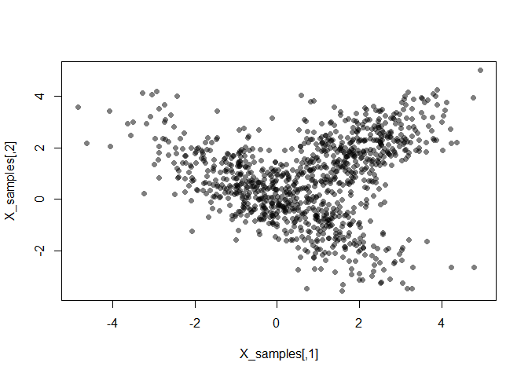
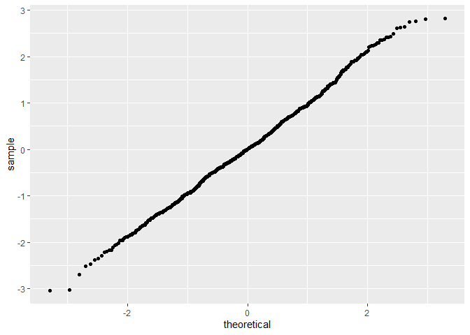
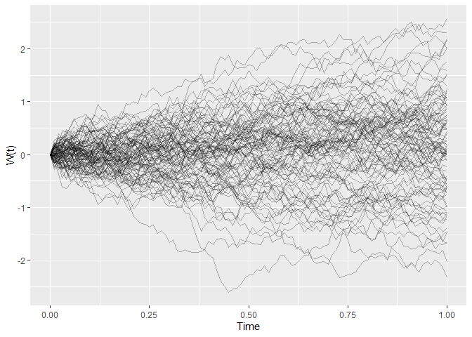
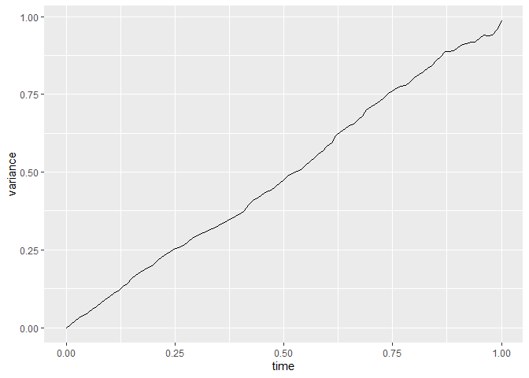
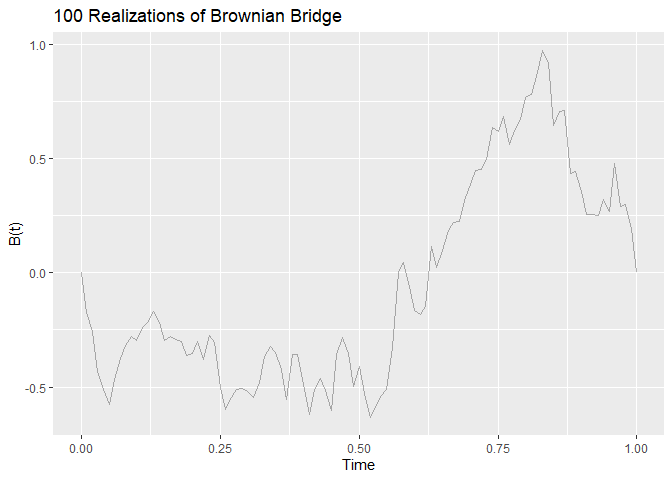
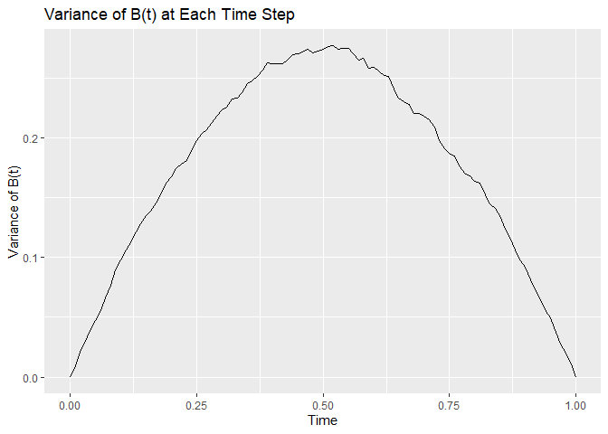

HW06
================
Vy Dang, ivydang

## Question 1 (6 points)

### Part (a) (2 point)

Consider the **mixture of multivariate Normals $(X_1, X_2)$** given by:

Implement a random number generator for this distribution and plot 1000
random $(X_1, X_2)$ points. There are several available multivariate
Normal PRNGs available for R, but your solution should use the
decomposition method we discuss in lecture. You way use
`rbinom(n, size = 1, prob = 0.5)` to generate the Bernoulli RV.

``` r
set.seed(123)
library(MASS)
```

    ## Warning: package 'MASS' was built under R version 4.2.1

    ## 
    ## Attaching package: 'MASS'

    ## The following object is masked from 'package:dplyr':
    ## 
    ##     select

``` r
mean_U <- c(0,0)
cov_U <- matrix(c(2, -1.5, -1.5, 2), nrow = 2)
mean_V <- c(2,2)
cov_V <- matrix(c(1, 0.5, 0.5, 1), nrow = 2)
n <- 1000
W <- rbinom(n, size = 1, prob = 0.6)
U_samples <- mvrnorm(n, mu = mean_U, Sigma = cov_U)
V_samples <- mvrnorm(n, mu = mean_V, Sigma = cov_V)
X_samples <- W * U_samples + (1-W) * V_samples
plot(X_samples, col = rgb(0, 0, 0, alpha = 0.5), pch = 16)
```



### Part (b) (2 points)

For any two bivariate Normal distributions $U$ and $V$ with means
$E(\mathbf{U}) = \mathbf{\mu_1} = (\mu_{11}, \mu_{12})^T$ and
$E(\mathbf{V}) = \mathbf{\mu_2} = (\mu_{21}, \mu_{22})^T$, prove that
the mean of the mixture with mixing parameter $\theta$ is a weighted sum
of the component means:
$$E \begin{pmatrix} X_1 \\ X_2 \end{pmatrix} = \begin{pmatrix} \theta \mu_{11} + (1 - \theta) \mu_{21} \\ \theta \mu_{12} + (1 - \theta) \mu_{22} \end{pmatrix}$$
Given: 1. $\mathbf{U} \sim N_2( \mathbf{\mu_1}, \Sigma_1 )$ with
$\mathbf{\mu_1} = \begin{pmatrix} \mu_{11} \\ \mu_{12} \end{pmatrix}$ 2.
$\mathbf{V} \sim N_2( \mathbf{\mu_2}, \Sigma_2 )$ with
$\mathbf{\mu_2} = \begin{pmatrix} \mu_{21} \\ \mu_{22} \end{pmatrix}$ 3.
$W$ is a Bernoulli random variable with parameter $\theta$, i.e.,
$W \sim \text{Bernoulli}(\theta)$ 4. The mixture is defined as
$\mathbf{X} = W \mathbf{U} + (1 - W) \mathbf{V}$

We find $E[\mathbf{X}]$:

By the linearity of expectation:

$$
E[\mathbf{X}] = E[W \mathbf{U} + (1 - W) \mathbf{V} = E[W \mathbf{U}] + E[(1 - W) \mathbf{V}]
$$

Since $W$ is independent of $\mathbf{U}$ and $\mathbf{V}$:

$$
E[W \mathbf{U}] = E[W] E[\mathbf{U}]
$$ $$
E[(1 - W) \mathbf{V}] = E[1 - W] E[\mathbf{V}]
$$

Since $W$ is a Bernoulli random variable with parameter $\theta$:

$$
E[W] = \theta
$$ $$
E[1 - W] = 1 - \theta
$$

$$
E[W \mathbf{U}] = \theta E[\mathbf{U}] = \theta \mathbf{\mu_1}
$$

$$
E[(1 - W) \mathbf{V}] = (1 - \theta) E[\mathbf{V}] = (1 - \theta) \mathbf{\mu_2}
$$

So we have:

$$
E[\mathbf{X}] = \theta \mathbf{\mu_1} + (1 - \theta) \mathbf{\mu_2}
$$

$$
E \begin{pmatrix} X_1 \\ X_2 \end{pmatrix} = \theta \begin{pmatrix} \mu_{11} \\ \mu_{12} \end{pmatrix} + (1 - \theta) \begin{pmatrix} \mu_{21} \\ \mu_{22} \end{pmatrix}
$$

$$
E \begin{pmatrix} X_1 \\ X_2 \end{pmatrix} = \begin{pmatrix} \theta \mu_{11} + (1 - \theta) \mu_{21} \\ \theta \mu_{12} + (1 - \theta) \mu_{22} \end{pmatrix}
$$

### Part (c) (2 points)

Using your MVN generator from part (a), estimate the covariance matrix
of $(X_1, X_2)$ using 10,000 samples. If you arrange your draws in a
10,000 by 2 matrix, you can use the `cov` function to estimate the
covariance.

From your results, would you say that the covariance of a mixture can be
expressed as the weighted average of the component covariances? In other
words, does your estimated covariance matrix look like
$0.6 \Sigma_U + 0.4 \Sigma_V$?

``` r
set.seed(1234)
library(MASS)
mean_U <- c(0,0)
cov_U <- matrix(c(2, -1.5, -1.5, 2), nrow = 2)
mean_V <- c(2,2)
cov_V <- matrix(c(1, 0.5, 0.5, 1), nrow = 2)
n <- 10000
W <- rbinom(n, size = 1, prob = 0.6)
U_samples <- mvrnorm(n, mu = mean_U, Sigma = cov_U)
V_samples <- mvrnorm(n, mu = mean_V, Sigma = cov_V)
X_samples <- W * U_samples + (1-W) * V_samples
cov(X_samples)
```

    ##          [,1]    [,2]
    ## [1,] 2.581507 0.27205
    ## [2,] 0.272050 2.52214

``` r
weighted_cov <- cov_U * 0.6 + cov_V * 0.4
weighted_cov
```

    ##      [,1] [,2]
    ## [1,]  1.6 -0.7
    ## [2,] -0.7  1.6

From the results we see that the estimated covariance matrix does not
exactly match the weighted average of the component covariances. The
covariance of a mixture is not simply a weighted average of the
component covariances.

## Question 2 (5 points)

Continuing our use of the Laplace distribution, we will use it as a
candidate distribution for the standard Normal $N(0,1)$ distribution
using an accept-reject algorithm.

Recall that the probability distribution for a standard Normal is given
by:

$$f(x) = \frac{1}{\sqrt{2 \pi}} \exp\left\{ - \frac{x^2}{2} \right\}$$

and the Laplace is given by
$$g(x) = \frac{1}{2} \exp\left\{- |x| \right\}$$

### Part (a) (2 pt)

Analytically (i.e., pen and paper, not computation), find a constant $c$
such that: $$ \frac{c g(x)}{f(x)} \ge 1$$ for all
$x \in (-\infty, \infty)$. As we have frequently done, it may be helpful
to consider $x < 0$ and $x \ge 0$ separately.

Given: $$
f(x) = \frac{1}{\sqrt{2 \pi}} \exp\left( - \frac{x^2}{2} \right)
$$ $$
g(x) = \frac{1}{2} \exp\left( - |x| \right)
$$

We have: $$
\frac{c g(x)}{f(x)} = \frac{c \left( \frac{1}{2} \exp\left( - |x| \right) \right)}{\frac{1}{\sqrt{2\pi}} \exp\left( - \frac{x^2}{2} \right)}
$$ $$
= \frac{c}{2} \cdot \sqrt{2\pi} \cdot \exp\left( -|x| + \frac{x^2}{2} \right)
$$

We need: $$
\frac{c}{2} \cdot \sqrt{2\pi} \cdot \exp\left( -|x| + \frac{x^2}{2} \right) \ge 1
$$

$$
c \ge \frac{2}{\sqrt{2\pi}} \cdot \exp\left( |x| - \frac{x^2}{2} \right)
$$

We must find the maximum value of the term
$\exp\left( |x| - \frac{x^2}{2} \right)$ over all $x$ to determine the
smallest possible $c$.

For $x \ge 0$: $$
\exp\left( |x| - \frac{x^2}{2} \right) = \exp\left( x - \frac{x^2}{2} \right)
$$

For $x < 0$: $$
\exp\left( |x| - \frac{x^2}{2} \right) = \exp\left( -x - \frac{x^2}{2} \right)
$$

$$
h'(x) = 1 - x
$$ $$
1 - x = 0 \Rightarrow x = 1
$$

The maximum value of $h$ at $x = 1$: $$
h(1) = 1 - \frac{1^2}{2} = \frac{1}{2}
$$

$$
c \ge \frac{2}{\sqrt{2\pi}} \exp\left( \frac{1}{2} \right)
$$

$$
c \ge \frac{2}{\sqrt{2\pi}} \cdot \exp\left( \frac{1}{2} \right) = \frac{2}{\sqrt{2\pi}} \cdot \sqrt{e}
$$

Since $\sqrt{2\pi} \approx 2.5066$: $$
c \ge \frac{2 \sqrt{e}}{2.5066}
$$

$$
\sqrt{e} \approx 1.6487
$$

So we have: $$
c \ge \frac{2 \cdot 1.6487}{2.5066} \approx 1.316
$$

We can choose 1.32.

### Part (b) (3 pt)

Implement an accept-reject algorithm for standard Normals using $c$ and
our usual source of Laplace random variables.

``` r
set.seed(1234)
rlaplace <- function(n, theta = 0) {
  s <- 2 * rbinom(n, size = 1, p = 0.5) - 1
  m <- rexp(n) 
  s * m + theta
}
f_y <- function(y) {
  (1/sqrt(2*pi)) * exp(-y^2/2)
}

g_y <- function(y) {
  (1/2) * exp(-abs(y))
}

c <- 1.32
accept_reject <- function(n) {
  samples <- numeric(n)
  accepted <- 0
  while (accepted < n) {
    y <-rlaplace(1)
    u <- runif(1)
    if (u <= (f_y(y)/ (c * g_y(y)))) {
      samples[accepted + 1] <- y
      accepted <- accepted + 1
    }
  }
samples
}
n_samples <- 1000
samples <- accept_reject(n_samples)
```

Using 1000 samples, verify that your Accept-Reject algorithm works using
a QQ-plot (see `geom_qq`).

``` r
ggplot(data_frame(sample = samples), aes(sample = sample)) + geom_qq()
```

    ## Warning: `data_frame()` was deprecated in tibble 1.1.0.
    ## ℹ Please use `tibble()` instead.
    ## This warning is displayed once every 8 hours.
    ## Call `lifecycle::last_lifecycle_warnings()` to see where this warning was
    ## generated.



## Question 3 (5 points)

### Part (a) (2 points)

[Section 4.2 of *Statistical Computing in
R*](https://ebookcentral-proquest-com.proxy.lib.umich.edu/lib/umichigan/detail.action?docID=5731927)
discusses a well known stochastic process called **Brownian Motion**.

Implement a function that will generate a Brownian Motion stochastic
process with $k$ steps on the interval (0, 1) and $W(0) = 0$. Plot 100
realizations of this process with $k = 100$

Using 1000 realizations of this process with $k = 100$, compute the
variance at each time step. Plot this variance and answer the question,
does the variance of $W(t)$ depend on $t$?

``` r
generate_brownian_motion <- function(k) {
  dt <- 1/k
  times <- seq(0, 1, by = dt)
  W <- numeric(length(times))
  for (i in 2:length(times)) {
    W[i] <- W[i-1] + rnorm(1, mean = 0, sd = sqrt(dt))
  }
  data.frame(time = times, W=W)
}

k <- 100
n_realizations <- 100
realizations <- lapply(1:n_realizations, function(x) generate_brownian_motion(k))

plot_data <- do.call(rbind, lapply(1:length(realizations), function(i) {
  cbind(realizations[[i]], realization = i)
}))

ggplot(plot_data, aes(x = time, y = W, group = realization)) +
  geom_line(alpha = 0.3) +
  xlab('Time') +
  ylab('W(t)')
```



``` r
n_samples_for_variance <- 1000
variance_realizations <- lapply(1:n_samples_for_variance, function(x) generate_brownian_motion(k))

time_steps <- seq(0, 1, by = 1/k)
variances <- sapply(1:(k+1), function(i) {
  var(sapply(variance_realizations, function(df) df$W[i]))
})

variance_data <- data.frame(time = time_steps, variance = variances)
ggplot(variance_data, aes(x = time, y = variance)) +
  geom_line()
```



The plot shows that the variance of W(t) is proportional to time t.

### Part (b) (3 points)

A variation Brownian Motion is known as the [Brownian
Bridge](https://en.wikipedia.org/wiki/Brownian_bridge). In the Brownian
Bridge, both the starting value and ending value are the same
$B(0) = B(T)$.

Implement a Brownian Bridge stochastic process similar to your previous
question. Use $k=100$ again and $B(0) = B(1) = 0$.

As before, graph 100 realizations of the process. Then generate 1000
realizations and compute the variance at each time step. Plot the this
variance as a function of the time step and answer the question, does
the variance of $B(t)$ depend on $t$?

``` r
generate_brownian_bridge <- function(k) {
  bm <- generate_brownian_motion(k)
  times <- bm$time
  W <- bm$W
  B <- W - times * W[length(W)]
  data.frame(time = times, B = B)
}

k <- 100
n_realizations <- 100
realizations <- lapply(1 < n_realizations, function(x) generate_brownian_bridge(k))

plot_data <- do.call(rbind, lapply(1:length(realizations), function(i) {
  cbind(realizations[[i]], realization = i)
}))

ggplot(plot_data, aes(x = time, y = B, group = realization)) +
  geom_line(alpha = 0.3) +
  ggtitle('100 Realizations of Brownian Bridge') +
  xlab('Time') +
  ylab('B(t)')
```



``` r
n_samples_for_variance <- 1000
variance_realizations <- lapply(1:n_samples_for_variance, function(x) generate_brownian_bridge(k))

time_steps <- seq(0, 1, by = 1 / k)
variances <- sapply(1:(k+1), function(i) {
  var(sapply(variance_realizations, function(df) df$B[i]))
})

variance_data <- data.frame(time = time_steps, variance = variances)
ggplot(variance_data, aes(x = time, y = variance)) +
  geom_line() +
  ggtitle('Variance of B(t) at Each Time Step') +
  xlab('Time') +
  ylab('Variance of B(t)')
```



The plot of the variance has a parabolic shape which indicates that the
variance depends on t and showing the characteristic behavior of the
Brownian Bridge Var(B(t)) = t(1-t)

## Question 4 (4 pts)

Please read Chapter 2 of “How to write a good scientific paper” by Chris
Mack (the [full
version](https://search.lib.umich.edu/catalog/record/99187409021506381)
can be found via the University library). While this book is aimed at
researchers trying to publish in scientific journals, the advice for
framing our research projects and structuring the paper is applicable to
undergraduate research as well.

### Part (a) (2 pt)

What does “IMRaD” stand for? For STATS 406, we are particularly
interested in the operating characteristics of our statistical methods.
Within the IMRaD format, where would you place a simulation study to
estimate the bias of an estimator?

IMRaD stands for:

- Introduction: Introduces the context and motivation for the research,
  addresses what the research is about, and why it matters

- Method: Provides a detailed description of the experimental design,
  theory, models, or tools used to conduct the research

- Results: Presents the findings from the research, often supported by
  tables, graphs, and figures

- Discussion: Interprets the results, compares them to previous work,
  highlights the significance, and shows how they answer the research
  questions posed in the introduction

A simulation study to estimate the bias of an estimator would be placed
within the Method section. This part should include the simulation study
details like how it is conducted and the steps taken to estimate the
bias. The actual bias results would be presented in the Results section
and interpreted in the Discussion section.

### Part (b) (2 pt)

What does Mack see as “a common shortcoming of method sections?” Using
tools already developed in STATS 406, what are some ways your can
address this short coming in your own research paper?

Mack identifies a common shortcoming of method sections in many
scientific papers as the inadequate level of detail that prevents other
researchers from reproducing the results. This inadequacy is often
driven by a desire for brevity or an assumption that readers will not
attempt to replicate the work. However, this lack of detail undermines
the fundamental scientific principles of reproducibility and validity.

Steps I can take to address this shortcoming:

- Provide a thorough step-by-step description of all procedures, from
  data collection to data analysis

- Include all the necessary information for another researcher to
  replicate my study including specifics on data sources, software used
  (including version numbers), code, and any parameters set during
  analysis

- Detail my statistical methods including sample sizes, methods for
  handling missing data, and the rationale behind choosing specific
  statistical tests or models

- Make my datasets publicly available using tools like GitHub or data
  repositories (e.g., Zenodo, Dryad)
