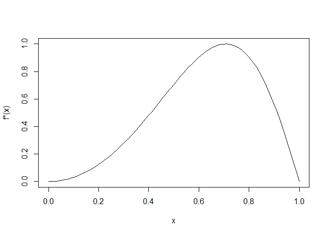
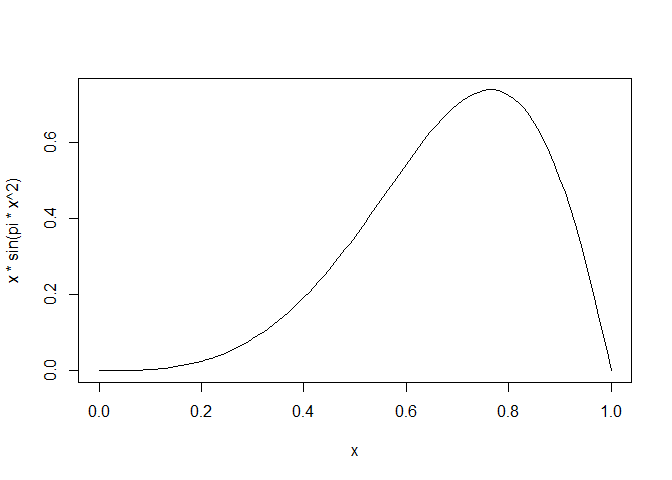
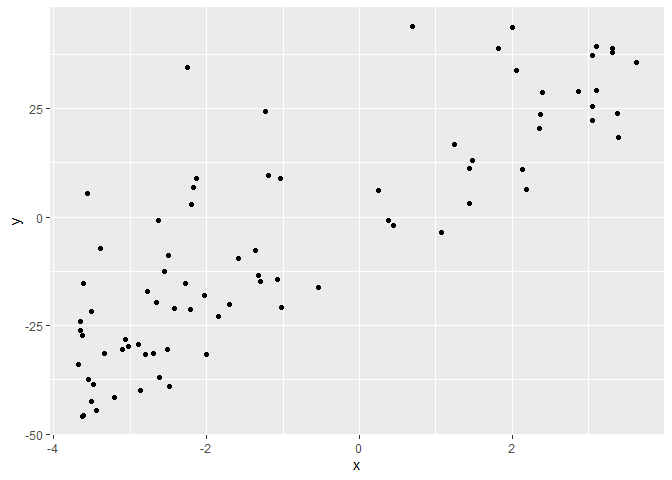
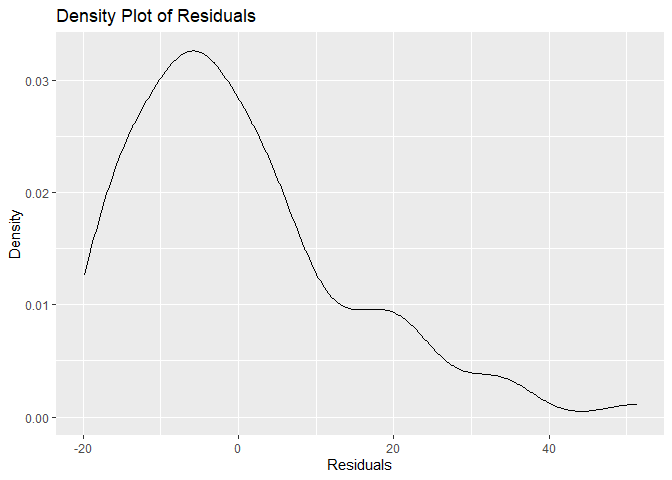

HW 07
================
Vy Dang, ivydang
Due 2022-03-21 at 11:59pm

## Question 1 (2 points)

In a previous week we used the Laplace distribution as a candidate
distribution for the standard Normal $N(0,1)$ distribution using an
accept-reject algorithm.

Recall that the probability distribution for a standard Normal is given
by:

$$f(x) = \frac{1}{\sqrt{2 \pi}} \exp\left\{ - \frac{x^2}{2} \right\}$$

and the Laplace is given by
$$g(x) = \frac{1}{2} \exp\left\{- |x| \right\}$$

And here is a source of Laplace distributed random variables.

``` r
rlaplace <- function(n, mean = 0) {
  s <- 2 * rbinom(n, size = 1, p = 0.5) - 1
  m <- rexp(n) 
  s * m + mean
}
```

Implement an importance sampling algorithm for standard Normals using
the Laplace distribution as the envelope distribution in order to
estimate

$$E(X^2)$$ where $X \sim N(0, 1)$. Use 1000 samples and provide a 95%
confidence interval for $E(X^2)$.

``` r
n <- 1000
x_laplace <-rlaplace(n)
f_x <- function(x) {
  (1 / sqrt(2 * pi)) * exp(- x^2 / 2)
}
g_x <- function(x) {
  (1 / 2) * exp(- abs(x))
}
weights <- f_x(x_laplace)/g_x(x_laplace)
x_squared <- x_laplace^2
weighted_estimate <- sum(weights * x_squared) / sum(weights)
var_weights_x_squared <- sum(weights * (x_squared - weighted_estimate)^2) / (sum(weights)^2)
standard_error <- sqrt(var_weights_x_squared / n)
confidence_interval <- weighted_estimate + c(-1, 1) * qnorm(0.975) * standard_error
weighted_estimate
```

    ## [1] 1.058349

``` r
confidence_interval
```

    ## [1] 1.055513 1.061186

## Question 2 (5 pts)

Consider the density (known up to a constant) given by:

$$f(x) \propto \sin(\pi  x^2), \quad 0 < x < 1$$

``` r
curve(sin(pi * x^2), ylab = "f*(x)")
```



### Part (a) (2 pts)

We want to estimate $E(X)$ using importance sampling (resampling).

Using a uniform \[0, 1\] distribution as the envelope, use (reweighted)
importance sampling to estimate $E(X)$. Estimate the variance of the
**estimator** (we’ll compare it to another estimator in part (b)).

``` r
n <- 1000
target_density <- function(x) {
  sin(pi * x^2)
}
x_uniform <- runif(n, min = 0, max = 1)

weights <- target_density(x_uniform)
normalized_weights <- weights / sum(weights)
estimate_E_X <- sum(normalized_weights * x_uniform)
variance_estimator <- sum(normalized_weights * (x_uniform - estimate_E_X)^2)
standard_error <- sqrt(variance_estimator / n)
estimate_E_X
```

    ## [1] 0.6374428

``` r
variance_estimator
```

    ## [1] 0.03720843

### Part (b) (3 pt)

The uniform distribution is a special case of the [Beta
distribution](https://en.wikipedia.org/wiki/Beta_distribution) with
parameters $\alpha = \beta = 1$. It works as an envelope, but it does
not very carefully follow the target function:
$$E(X) \propto \int_0^1 x \sin(\pi x^2) \, dx$$

``` r
curve(x * sin(pi * x^2))
```



Propose a set of parameters $\alpha$ and $\beta$ that leads to a better
envelope distribution. Use this distribution (see the `rbeta` function)
to implement importance sampling to estimate $E(X)$ and the variance of
the estimator. Did this estimator have lower variance than the estimator
based on the uniform candidate?

Useful tip: A Beta($\alpha, \beta$) with $\alpha > 1$ and $\beta > 1$
will have a mode at $(\alpha - 1) / (\alpha + \beta - 2)$. This can be
useful to graph candidate distributions against the target:

``` r
## target function has a mode at approximately 0.76
target_height <- 0.76 * sin(pi * 0.76^2)

## candidate beta distribution alpha = beta = 2, so a mode at 1/2
cand_height <- dbeta(1/2, 2, 2)

tc_ratio <- target_height/cand_height

curve(x * sin(pi * x^2))
curve(tc_ratio * dbeta(x, 2, 2), add = TRUE, col = "red")
```

<!-- -->

``` r
n <- 1000
target_density <- function(x) {
  sin(pi * x^2)
}
alpha <- 3
beta <- 2
x_beta <- rbeta(n, alpha, beta)
weights <- target_density(x_beta) / dbeta(x_beta, alpha, beta)
normalized_weights <- weights / sum(weights)
estimate_E_X <- sum(normalized_weights * x_beta)
variance_estimator <- sum(normalized_weights * (x_beta - estimate_E_X)^2)
standard_error <- sqrt(variance_estimator / n)
estimate_E_X
```

    ## [1] 0.6297666

``` r
variance_estimator
```

    ## [1] 0.03629242

``` r
standard_error
```

    ## [1] 0.006024319

This estimator have higher variance than the estimator based on the
uniform candidate.

## Question 3 (4 pts)

Consider sampling $n$ pairs $(Y_i, X_i)$ from a very large population of
size $N$. We will assume that the population is so large that we can
treat $n/N \approx 0$, so that all pairs in our sample are effectively
independent.

``` r
xy <- read.csv("xy.csv")
ggplot(xy, aes(x = x, y = y)) + geom_point()
```



For the population, you want to relate $Y$ and $X$ as a linear function:
$$Y_i = \beta_0 + \beta_1 X_i + R_i$$ where $$
\begin{aligned}
\beta_1 &= \frac{\text{Cov}(X,Y)}{\text{Var}(X)} \\
\beta_0 &= E(Y) - \beta_1 E(X) \\
R_i &= Y_i - \beta_0 - \beta_1 X_i
\end{aligned}
$$

The the line described by $\beta_0$ and $\beta_1$ is the “population
regression line”. We don’t get to observe $R_i$ for our sample, but we
can estimate $\beta_0$ and $\beta_1$ to get estimates of $R_i$.

### Part (a) (2 points)

The `lm` function in R can estimate $\beta_0$ and $\beta_1$ using sample
means and variances. Since these estimators are based on sample means,
we can use the **central limit theorem** to justify confidence intervals
for $\beta_0$ and $\beta_1$ (we won’t do so rigorously in this setting).

Use the `lm` function to estimate $\beta_0$ and $\beta_1$. Apply the
`confint` function to the results to get 95% confidence intervals for
the $\beta_1$ parameter.

The estimated residuals ($\hat R_i$) can be found by applying the
`resid` function to the result of `lm`. Provide a density plot of these
values (see `geom_density`). Do they give you any reason to be concerned
about the validity of the Central Limit Theorem approximation?

``` r
model <- lm(y~x, data = xy)
summary(model)
```

    ## 
    ## Call:
    ## lm(formula = y ~ x, data = xy)
    ## 
    ## Residuals:
    ##     Min      1Q  Median      3Q     Max 
    ## -19.851  -9.774  -3.774   6.063  51.334 
    ## 
    ## Coefficients:
    ##             Estimate Std. Error t value Pr(>|t|)    
    ## (Intercept)   3.2514     1.7045   1.908   0.0601 .  
    ## x             9.0037     0.6577  13.690   <2e-16 ***
    ## ---
    ## Signif. codes:  0 '***' 0.001 '**' 0.01 '*' 0.05 '.' 0.1 ' ' 1
    ## 
    ## Residual standard error: 14.31 on 78 degrees of freedom
    ## Multiple R-squared:  0.7061, Adjusted R-squared:  0.7023 
    ## F-statistic: 187.4 on 1 and 78 DF,  p-value: < 2.2e-16

``` r
conf_intervals <- confint(model, level = 0.95)
beta1_confint <- conf_intervals["x", ]
beta1_confint
```

    ##     2.5 %    97.5 % 
    ##  7.694352 10.313126

``` r
residuals <- resid(model)
ggplot(data.frame(residuals = residuals), aes(x = residuals)) + geom_density() +
  labs(title = "Density Plot of Residuals", x = "Residuals", y = "Density")
```



For the CLT to be valid, the residuals should ideally be approximately
normal. Here the density plot shows a significant deviation from
normality and we see that it is right skewed. There might be potential
issues with the normality assumption.

### Part (b) (2 pts)

You can use the `coef` function to get just the estimators
$\hat \beta_0$ and $\hat \beta_1$. Use the `boot` package to get basic
and percentile confidence intervals for just $\beta_1$. You will need to
write a custom function to give as the `statistic` argument to `boot`.
Use at least 1000 bootstrap samples. You can use `boot.ci` for the
confidence intervals.

Comment on the assumptions required for the bootstrap intervals.

``` r
library(boot)
boot_fn <- function(data, indices) {
  d <- data[indices, ]
  model <- lm(y~x, data = d)
  return(coef(model)[2])
}
set.seed(123)
boot_results <- boot(data = xy, statistic = boot_fn, R = 1000)
ci_basic <- boot.ci(boot_results, type = "basic")
ci_percentile <- boot.ci(boot_results, type = "perc")
ci_basic
```

    ## BOOTSTRAP CONFIDENCE INTERVAL CALCULATIONS
    ## Based on 1000 bootstrap replicates
    ## 
    ## CALL : 
    ## boot.ci(boot.out = boot_results, type = "basic")
    ## 
    ## Intervals : 
    ## Level      Basic         
    ## 95%   ( 7.939, 10.083 )  
    ## Calculations and Intervals on Original Scale

``` r
ci_percentile
```

    ## BOOTSTRAP CONFIDENCE INTERVAL CALCULATIONS
    ## Based on 1000 bootstrap replicates
    ## 
    ## CALL : 
    ## boot.ci(boot.out = boot_results, type = "perc")
    ## 
    ## Intervals : 
    ## Level     Percentile     
    ## 95%   ( 7.924, 10.068 )  
    ## Calculations and Intervals on Original Scale

Assumptions for using bootstrap intervals:

- Independence: This method assumes that the sample pairs (Yi,Xi) are
  independently drawn. For a large population and a small sample size
  relative to the population treating the sample as independent is fine

- Identically Distributed: The data should be from the same
  distribution. There should not be substantial heterogeneity within the
  sampled pairs that would violate the i.i.d. assumption

- Representative Sample: The sample should effectively represent the
  population to ensure that bootstrap replicates reflect the population
  variability

## Question 4 (7 pts)

Suppose that instead of sampling pairs, we first identified some
important values of $x$ that we wanted to investigate. Treating these
values as fixed, we sampled a varying number of $Y_i$ for each $x$
value. For these data, we’ll attempt to model the conditional
distribution of $Y \, | \, x$ as:
$$Y \, | \, x = \beta_0 + \beta_1 x + \epsilon$$ where $\epsilon$
epsilon is assumed to be symmetric about zero (therefore,
$E(\epsilon) = 0$) and the variance of $\epsilon$ does not depend on $x$
(a property called “homoskedasticity”). These assumptions are very
similar to the population regression line model (as $E(R_i) = 0$ by
construction), but cover the case where we want to design the study on
particular values (a common case is a randomized trial where $x$ values
are assigned from a known procedure and $Y$ is measured after).

### Part (a) (3 pts)

Let’s start with some stronger assumptions and then relax them in the
subsequent parts of the question.

The assumptions that support the Central Limit Theorem in Question 1 can
also be used to assume that $\epsilon \sim N(0, \sigma^2)$ so that:

$$Y \mid x \sim N(\beta_0 + \beta_1 x, \sigma^2)$$

We’ve noticed that the Normal distribution has “light tails” and
assumptions based on Normality can be sensitive to outliers.

Instead, suppose we we model $\epsilon$ with a scaled $t$-distribution
with 4 degrees of freedom (i.e., has fatter tails than the Normal
distribution):
$$\epsilon \sim \frac{\sigma}{\sqrt{2}} t(4) \Rightarrow \text{Var}(\epsilon) = \sigma^2$$
(The $\sqrt{2}$ is there just to scale the $t$-distribution to have a
variance of 1. More generally, if we picked a differed degrees of
freedom parameter $v$, this would be replaced with $\sqrt{v/(v-2)}$.)

One way to get an estimate of the distribution of $\hat \beta_1$ is the
following algorithm:

1.  Estimate $\beta_0$, $\beta_1$, and $\sigma$ using linear regression
    (you can get the $\hat \sigma$ using `summary(model)$sigma`),
2.  For all the $x_i$ in the sample, generate
    $\hat y_i = \hat \beta_0 + \hat \beta_1 x_i$ (you can use
    `predict(model)` to get $\hat y$)
3.  For $B$ replications, generate $Y_i^* = \hat y_i + \epsilon_i*$,
    where $$\epsilon^* \sim \frac{\hat \sigma}{\sqrt{2}} t(4)$$
4.  For each replication, use linear regression to estimate
    $\hat \beta_1^*$.
5.  Use the $\alpha/2$ and $1 - \alpha/2$ quantiles of the bootstrap
    distribution to get the confidence intervals:
    $$[2 \hat \beta_1 - \hat \beta_1^*(1 - \alpha/2), 2 \hat \beta_1 - \hat \beta_1^*(\alpha/2)]$$
    To avoid double subscripts I’ve written
    $\hat \beta^*_1(1 - \alpha/2)$ as the upper $1 - \alpha/2$ quantile
    of the bootstrap (and likewise for the lower $\alpha/2$ quantile).

You may note that this is a “basic” basic bootstrap interval. In fact,
this procedure (fitting parameters, then simulating from a model) is
known as a **parametric bootstrap**.

Use the algorithm above to generate a confidence interval for $\beta_1$.
Compare it to the fully parametric interval produced in Question 1(a).
Which is larger or smaller?

Note: The `boot` function does have the option of performing a
parametric bootstrap using a user supplied `rand.gen` function. Feel
free to use this functionality, but you may find it easier to implement
the algorithm directly.

``` r
library(MASS)
```

    ## Warning: package 'MASS' was built under R version 4.2.1

    ## 
    ## Attaching package: 'MASS'

    ## The following object is masked from 'package:dplyr':
    ## 
    ##     select

``` r
B <- 1000
model <- lm(y~x, data = xy)
y_hat <- predict(model)
beta_hat <- coef(model)
sigma_hat <- summary(model)$sigma
bootstrap_replication <- function(data, fitted_y, beta_hat, sigma_hat, n) {
  epsilon_star <- (sigma_hat / sqrt(2)) * rt(n, df = 4)
  y_star <- fitted_y + epsilon_star
  model_star <- lm(y_star ~ data$x)
  return(coef(model_star)[2])
}

beta_1_star <- numeric(B)
set.seed(123)  
for (b in 1:B) {
  beta_1_star[b] <- bootstrap_replication(xy, y_hat, beta_hat, sigma_hat, nrow(xy))
}

alpha <- 0.05
ci_lower <- quantile(beta_1_star, alpha / 2)
ci_upper <- quantile(beta_1_star, 1 - alpha / 2)

ci_basic <- c(2 * beta_hat[2] - ci_upper, 2 * beta_hat[2] - ci_lower)
conf_intervals <- confint(model, level = 0.95)
beta1_confint <- conf_intervals["x",]
ci_basic
```

    ##         x         x 
    ##  7.668995 10.301307

``` r
beta1_confint
```

    ##     2.5 %    97.5 % 
    ##  7.694352 10.313126

``` r
ci_basic[2]-ci_basic[1]
```

    ##        x 
    ## 2.632313

``` r
beta1_confint[2]-beta1_confint[1]
```

    ##   97.5 % 
    ## 2.618774

The lengths show that the Bootstrap Interval is slightly longer than the
Traditional Interval. The parametric bootstrap confidence interval is
slightly larger than the traditional parametric confidence interval
obtained via the lm function.

### Part (b) (3 pts)

As an alternative to sampling from an assumed distribution for
$\epsilon$, we can replace step (3) in the previous algorithm with

3.  Draw a sample (with replacement) from $\hat \epsilon_i$ and make
    $Y_i^* = \hat y_i + \epsilon_i^*$

Implement this version of a parametric bootstrap. Feel free to use the
`boot` package.

``` r
bootstrap_with_residuals <- function(data, fitted_y, residuals, n) {
  epsilon_star <- sample(residuals, size = n, replace = TRUE)
  y_star <- fitted_y + epsilon_star
  model_star <- lm(y_star ~ data$x)
  return(coef(model_star)[2])
}
set.seed(123)  
for (b in 1:B) {
  beta_1_star[b] <- bootstrap_with_residuals(xy, y_hat, residuals, nrow(xy))
}

alpha <- 0.05
ci_lower <- quantile(beta_1_star, alpha / 2)
ci_upper <- quantile(beta_1_star, 1 - alpha / 2)

ci_basic <- c(2 * beta_hat[2] - ci_upper, 2 * beta_hat[2] - ci_lower)
ci_basic
```

    ##        x        x 
    ##  7.72943 10.19110

### Part (c) (1 pt)

Discuss the differences in the four types of intervals we created (fully
parametric in 1(a), non-parametric bootstrap in 1(b), two variations of
parametric bootstrap in 2(a) and 2(b)). When analyzing a particular data
set, when would you pick one method over the another methods?

Fully Parametric Interval (Question 1(a)):

- Method: Uses the lm function for linear regression, assuming that the
  residuals are normally distributed
- Assumptions: Assumes normality of the errors, linearity of the
  relationship between X and Y, and homoskedasticity (constant variance
  of the errors)

Non-parametric Bootstrap (Question 1(b)):

- Method: Uses the boot package to resample the data pairs (Xi,Yi) with
  replacement and computes confidence intervals based on the sampled
  distributions
- Assumptions: Relies on the independence and identically distributed
  (i.i.d.) nature of the data, less sensitive to the normality
  assumption

Parametric Bootstrap with Assumed Distribution (Question 4(a)):

- Method: Uses a parametric bootstrap approach where residuals are
  simulated from an assumed scaled t-distribution instead of the normal
  distribution
- Assumptions: Assumes the residuals follow a t-distribution with a
  specified degrees of freedom; requires that the choice of the assumed
  distribution accurately reflects the data

Bootstrap with Resampled Residuals (Question 4(b)):

- Method: Samples residuals with replacement to generate new bootstrap
  samples. This avoids making strong parametric assumptions about the
  residual distribution
- Assumptions: Assumes the residuals are a reliable representation of
  the underlying data variability, and that they can be resampled
  independently

When to Pick Each Method:

- Fully Parametric Interval: When the sample size is reasonably large,
  the residuals appear normally distributed, and the other regression
  assumptions (linearity, homoskedasticity) are met
- Non-parametric Bootstrap: When we are not sure about the normality of
  residuals or other standard assumptions and the sample size is large
  enough to ensure robust resampling. Ideal for more general
  applications where fewer assumptions are safer
- Parametric Bootstrap with Assumed Distribution: When there is evidence
  that the residuals follow a specific known distribution other than
  normal (e.g., heavier tails) and when the distributional assumptions
  about the residuals can be justified
- Bootstrap with Resampled Residuals: When the data shows complex
  patterns that are hard to characterize with standard parametric
  distributions. Useful when we want to account for the actual observed
  patterns in the data’s variability (non-linearity, non-constant
  variance, etc.)

## Question 5 (2 pts)

Read the paper “THE RISK OF CANCER ASSOCIATED WITH SPECIFIC MUTATIONS OF
BRCA1 AND BRCA2 AMONG ASHKENAZI JEWS.” Briefly summarize the paper. Make
sure to discuss the research question, data source, methods, and
results. How did the authors use the bootstrap procedure in this paper?

- Research Question: The study investigates the risk of breast, ovarian,
  and prostate cancer associated with specific mutations (185delAG and
  5382insC in BRCA1 and 6174delT in BRCA2) among Ashkenazi Jews. The key
  research question is to estimate the risk of these cancers in a
  general population of Ashkenazi Jews, comparing it to previous
  estimates which were based on high-risk families

- Data Source: The data were collected from 5318 Jewish men and women
  above the age of 20 from the Washington, D.C., area. Blood samples
  were collected to check for BRCA1 and BRCA2 mutations, and
  epidemiological questionnaires were filled out to capture demographic
  and family health history

- Methods:

- Mutation Identification: Blood samples were analyzed to identify
  carriers of the mutations 185delAG and 5382insC in BRCA1, and 6174delT
  in BRCA2 using allele-specific oligonucleotide assays and polymerase
  chain reaction methods

- Data Analysis: The risks of cancer (breast, ovarian, and prostate)
  were compared between carriers and noncarriers of these mutations by
  analyzing cancer history in first-degree relatives

- Statistical Analysis: Kaplan-Meier curves were used to estimate the
  relative risk of cancer. For risk estimation, the researchers compared
  cancer incidence in relatives of mutation carriers to that in
  noncarriers

- Bootstrap Procedure

- Results: By age 70, the estimated risk of breast cancer among carriers
  of a BRCA1 or BRCA2 mutation was 56% (95% CI, 40 to 73%). For
  noncarriers, the risk was 13% (95% CI, 12 to 14%). By age 70, the
  estimated risk of ovarian cancer among carriers was 16% (95% CI, 6 to
  28%). The risk for noncarriers was 1.6% (95% CI, 1.2 to 2%). At age
  70, the estimated risk was 16% (95% CI, 4 to 30%) for mutation
  carriers. For noncarriers, the risk was 3.8% (95% CI, 3.3 to 4.4%). No
  significant differences in breast cancer risk were found between
  carriers of BRCA1 and BRCA2 mutations. Carriers of the BRCA1 mutation
  5382insC showed a higher (though not statistically significant) risk
  of ovarian cancer than carriers of other mutations

- Use of the Bootstrap Procedure: The authors used the bootstrap
  procedure to calculate the variance of cancer risk estimates. This
  nonparametric method provided robust 95% confidence intervals for the
  estimated risks by generating 1000 random samplings of the data. Each
  family was a unit. This involved resampling the families with
  replacement to achieve robust and accurate confidence intervals
